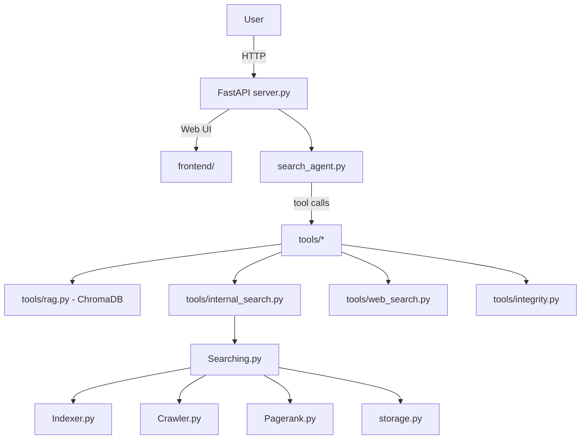

# RigorousRAG — Complete Codebase Analysis

A line-by-line deep-dive of every file, class, and function in the repository.

---

## Architecture Overview

The project is a **two-layer academic research engine**.

**Layer 1 — Classic IR Search Engine:** `Crawler → Indexer → Pagerank → Searching → Storage`
This is a standalone, self-contained BM25/TF-IDF + PageRank search engine over crawled trusted academic domains.

**Layer 2 — LLM Agentic RAG:** `server.py → SearchAgent → tools/*`
This wraps layer 1 and adds a full agentic loop (OpenAI tool-use), vector-based RAG (ChromaDB), HyDE, document ingestion, scientific integrity tools, and a web frontend.

---

## `trusted_sources.py`

### Data: `SourceCategory` (frozen dataclass)
Holds a `name`, `description`, and `seeds` list for a category of trusted sources. Frozen = immutable after construction.

### Data: `CATEGORIES` (module-level list)
A hardcoded list of 10 `SourceCategory` instances covering: Reference & Encyclopedias, Academic Journals, Preprint Servers, Education, Medical, Government, Science Agencies, Libraries, Data Portals, and Fact-Checking. Each category provides its own seed URLs.

### `iter_all_seed_urls() → Iterable[str]`
A generator that yields every seed URL from every category by iterating `CATEGORIES` and yielding from each `category.seeds`. This is O(total seeds).

### `ALL_TRUSTED_SEEDS: List[str]` (module-level)
Materialized sorted + deduplicated list from `iter_all_seed_urls()`. This is the master URL list for the crawler.

### `derive_domain_suffixes(urls) → Set[str]`
For each URL, parses the `netloc`, adds it to the set, and if it starts with `www.`, also adds the bare domain (without `www.`). This ensures `mit.edu` and `www.mit.edu` are both recognized. Returns the set of all authority strings to use as an allowlist.

### `ALL_TRUSTED_DOMAINS: Set[str]` (module-level)
Computed once at import by calling `derive_domain_suffixes(ALL_TRUSTED_SEEDS)`. Used by the crawler as its allowlist.

### `category_map() → Dict[str, List[str]]`
Returns `{category_name: [seed_urls]}` — a simple view of the data, likely unused in production but useful for debugging or UI display.

---

## `Crawler.py`

### Module-level constants
- `DEFAULT_USER_AGENT`: Declares the bot as "AcademicSearchBot/2.0" with a fake info page URL, polite crawling convention.
- `REQUEST_TIMEOUT = 10`: Hard 10-second limit per HTTP request.
- `ALLOWED_MIME_TYPES`: Only HTML and XHTML are accepted; PDFs, JSON, etc. are rejected.
- `MAX_CONTENT_LENGTH = 2_500_000`: ~2.5 MB, prevents downloading huge files.
- `MIN_CONTENT_LENGTH = 512`: Pages with fewer than 512 bytes of content are skipped.

### `is_trusted_domain(url, allowed_suffixes) → bool`
Takes a URL and an iterable of allowed domain suffixes. Parses the `netloc`, lowercases it, then checks if it equals any suffix exactly **or** ends with `.{suffix}`. This handles both apex domains and all subdomains (e.g., `journals.example.edu` is trusted if `example.edu` is in the list). Returns `False` if the URL has no netloc.

### `normalize_url(url) → str`
Parses the URL; rejects any scheme that isn't `http` or `https` (eliminates `ftp:`, `javascript:`, `mailto:` etc.). Rejects URLs with no `netloc`. Strips the `fragment` (`#anchor`) part using `_replace()` on the named tuple and then rebuilds with `urlunparse`. This ensures `http://x.com/a#section1` and `http://x.com/a` are treated as the same URL.

### `Page` (dataclass)
A simple value object: `url str`, `title str`, `text str`, `links List[str]`, `content_type str`, `content_length int`. Acts as the output of a successful page fetch.

### `AcademicCrawler`
A BFS (breadth-first search) crawler constrained to trusted domains.

#### `__init__(...)`
Stores all configuration parameters, creates a persistent `requests.Session` (connection pooling, shared headers), sets the User-Agent header, and initializes `_robots_cache: Dict[str, RobotFileParser]` for caching robots.txt decisions per domain.

#### `crawl(seeds, state=None) → CrawlState`
The main BFS loop. If no `CrawlState` is provided, creates an empty one. Initializes from the existing state: `pages`, `graph`, `visited` sets, and frontier queue. Seeds the queue with normalized seed URLs not already visited. Tracks `domain_counts` to enforce `max_pages_per_domain`. The loop pops `(url, depth)` pairs. Each URL is validated for:
1. Not already visited and within max depth.
2. Is a trusted domain.
3. Under the per-domain quota.
4. Allowed by that domain's `robots.txt`.

If all checks pass, calls `_fetch_page`. On success, stores the `Page`, updates the link graph (`graph[url].add(link)`), increments domain count, and enqueues children if they're within depth, trusted, and not duplicate. Sleeps `request_delay` seconds between fetches. After the loop, writes back to the `CrawlState` and returns it. This is a **resumable** crawl.

#### `_fetch_page(url) → Optional[Page]`
Uses the shared session to GET the URL with redirects allowed. On HTTP error, returns `None`. Checks `Content-Type` header (strips parameters like `; charset=utf-8`), checks `Content-Length` header for size limits, calls BeautifulSoup for parsing. Also rejects pages whose *extracted text* is under `MIN_CONTENT_LENGTH`. Returns a `Page` if all passes.

#### `_extract_title(soup) → str`
Checks `soup.title.string`, then falls back to first `<h1>` or `<h2>`, then `"Untitled"`.

#### `_extract_text(soup) → str`
Destructively decomposes all `script`, `style`, `noscript`, `header`, `footer`, `nav`, `aside` elements (boilerplate removal). Then calls `get_text(separator=" ")` and collapses whitespace with `" ".join(text.split())`.

#### `_extract_links(base_url, soup) → List[str]`
Finds all `<a href>` tags. For each: resolves relative URLs with `urljoin`, normalizes with `normalize_url`, then filters out self-links, untrusted domains, and robots.txt-disallowed links. Returns deduplicated list.

#### `_is_allowed_by_robots(url) → bool`
Parses the scheme+host into a base URL. Checks `_robots_cache`; if not cached, creates a `RobotFileParser`, sets its URL to `{base}/robots.txt`, calls `read()` (which fetches it). Any exceptions during `read()` are silently ignored (assumes permissive). Then calls `can_fetch(user_agent, url)`. Any exception here returns `True` (fail-open, permissive).

#### `_under_domain_quota(url, domain_counts) → bool`
Parses netloc, returns `True` if current count < `max_pages_per_domain`, `False` if no netloc.

---

## `Indexer.py`

### `STOP_WORDS`
A module-level `set[str]` of ~100 common English stop words. Using a `set` makes membership checks O(1).

### `TOKEN_PATTERN = re.compile(r"[a-zA-Z]{2,}")`
Only extracts alphabetic sequences of 2+ characters. This discards numbers, punctuation, and single-character tokens. Compiled once at module level for efficiency.

### `tokenize(text) → List[str]`
Uses `TOKEN_PATTERN.finditer` to extract all matches, lowercases them, then filters out stop words. Returns a list of meaningful tokens (multi-set, not deduplicated).

### `build_snippet(text, max_words=40) → str`
Splits on whitespace, takes the first 40 words, rejoins. Fast, dumb summary — used as the search result preview.

### `DocumentMetadata` (dataclass)
Value object stored in the index: `title`, `snippet`, `length` (token count).

### `InvertedIndex`
A sparse TF-IDF inverted index with cosine similarity support.

#### `__init__()`
Initializes `documents: Dict[url, DocumentMetadata]`, `index: Dict[term, Dict[url, float]]` (the actual term → postings list), `idf: Dict[term, float]`, `doc_norms: Dict[url, float]` (L2 norm of each document's TF-IDF vector).

#### `build(pages) → None`
Two-pass construction:
- **Pass 1:** For each page, tokenizes body and title. Applies a **+2 title boost**: each title token is added 2 extra times to the `Counter`, making title matches ~3x more important than body text. Stores per-document `Counter`. Tracks `term_document_frequency` (how many docs each term appears in). Builds `DocumentMetadata` snippets.
- **Pass 2:** Computes IDF as `log((1+N)/(1+df)) + 1` (smoothed IDF, always ≥ 1). Then computes TF-IDF weights: `(1 + log(tf)) * idf` (log-normalized TF). Stores weights in `self.index[term][url]`. Also computes `doc_norms[url]` as `sqrt(sum of weight²)` for cosine normalization.

#### `to_dict() → Dict`
Serializes to JSON-compatible dict: documents (using `asdict`), index postings, idf, doc_norms.

#### `from_dict(payload) → InvertedIndex` (classmethod)
Deserializes from the dict. Carefully handles missing keys and type casting (e.g., `float(weight)`) to guard against storage corruption.

---

## `Pagerank.py`

### `compute_pagerank(graph, damping=0.85, iterations=20) → Dict[str, float]`
A pure-function, power-iteration PageRank implementation.
1. Collects all nodes from the graph (both source and target of edges) to handle nodes that only appear as link targets.
2. Initializes each node's rank to `1/N`.
3. Builds `adjacency` dict assigning each node an outgoing edge set (empty for dangling nodes).
4. Iterates 20 times:
   - Sets base rank of each node to `(1-damping)/N` (teleportation).
   - Handles **dangling nodes** (no outgoing links): their rank is collected, multiplied by `damping`, divided evenly among all nodes. This prevents rank sinks.
   - Distributes each non-dangling node's `damping * rank[node] / len(edges)` to each outgoing neighbor.
   - Adds `sink_distribution` to all nodes.
5. Returns the final rank dict. 20 iterations is sufficient for convergence on most graphs.

---

## `storage.py`

### `CrawlState` (dataclass)
Holds: `pages: Dict[str, Page]`, `graph: Dict[str, Set[str]]`, `visited: Set[str]`, `frontier: List[Tuple[str, int]]`. The `empty()` classmethod creates an empty instance.

### `StorageManager`
Manages three JSON files in a `data/` directory.

#### `__init__(base_dir)`
Creates the directory if needed. Defines paths: `crawl_state.json`, `index.json`, `pagerank.json`.

#### `load_crawl_state() → CrawlState`
Reads JSON, deserializes each page from its dict representation back into `Page` dataclass instances, converts graph edge lists back to `Set[str]`, converts visited back to `set`, and parses frontier as `(url, depth)` tuples. Guards against malformed entries.

#### `save_crawl_state(state) → None`
Serializes everything to JSON: pages as nested dicts, graph edge sets as sorted lists (deterministic output), visited as sorted list, frontier as `[{"url": ..., "depth": ...}]`.

#### `load_index() / save_index()`
Uses `InvertedIndex.from_dict` / `InvertedIndex.to_dict` to round-trip the index via JSON.

#### `load_pagerank() / save_pagerank()`
Simple `Dict[str, float]` ↔ JSON round-trip.

---

## `Searching.py`

### `SearchHit` (dataclass)
The result of a single search: `rank`, `url`, `title`, `snippet`, `score` (combined), `cosine`, `pagerank`, `length`.

### `AcademicSearchEngine`
High-level orchestration gluing crawler, indexer, PageRank, and storage.

#### `__init__(...)`
Loads all persisted state on startup: crawl state, inverted index, PageRank scores. Immediately ready to serve queries without re-crawling.

#### `build() → int`
Runs the crawler from existing state, saves it, rebuilds the index from scratch, saves it, recomputes PageRank, saves it. Returns the total page count. This is the "re-index" operation.

#### `search(query, limit=10) → List[SearchHit]`
1. Tokenizes the query.
2. Computes the query TF-IDF vector (same formula as for documents: log-normalized TF × IDF).
3. Computes dot products between query and document vectors by iterating the inverted index's postings.
4. Normalizes by both document norm and query norm → cosine similarity.
5. Blends: `combined_score = 0.85 * cosine + 0.15 * pagerank`. PageRank acts as a global quality prior.
6. Sorts descending, assigns ranks 1..N, returns top `limit`.

#### `gather_context(hits, max_chars=6000) → List[Dict]`
Returns the full page text for each hit, capped so total characters don't exceed `max_chars`. Divides the budget equally among hits (`chunk_size = max_chars // len(hits)`). Stops adding context once budget is consumed.

#### `interactive_loop(limit=10) → None`
A blocking REPL loop. Reads from `stdin`, calls `search`, pretty-prints hits with rank, URL, snippet, and scores.

### `parse_args() / main()`
CLI entrypoint: parses `--max-pages`, `--max-depth`, `--delay`, `--results`, builds the engine, and runs the interactive loop.

---

## `llm_agent.py`

### `CitationSummary` (dataclass)
`summary: str` and `sources: List[str]`. The output of a summarization call.

### `ExtractiveFallback`
#### `summarise(query, hits, contexts) → CitationSummary`
When no neural LLM is available, creates a numbered list where each entry is `[i] Title: first 280 chars of context`. A simple but fully offline fallback.

### `LLMAgent`
Supports OpenAI API, Ollama (local LLM), and extractive fallback in that priority order.

#### `__init__(...)`
Tries to initialize `OpenAI` client (needs API key). Tries to initialize `ollama.Client` (falls back to using the `ollama` module object directly, handling both new and old python-ollama API signatures). Stores `ExtractiveFallback` as last resort.

#### `summarise(query, hits, contexts) → CitationSummary`
Builds a prompt, then tries OpenAI → Ollama → Extractive fallback in sequence.

#### `_summarise_with_openai(prompt, hits) → CitationSummary | None`
Calls `chat.completions.create` with temperature=0.2 (near-deterministic), `top_p=0.9`, system prompt instructing citation format. Returns `None` on any exception.

#### `_summarise_with_ollama(prompt, hits) → CitationSummary | None`
Handles both new-style (`ollama.Client.chat(model=..., messages=...)`) and old module-level API (`ollama.chat(model=..., host=...)`). Extracts response content via `response.get("message", {}).get("content")`.

#### `_build_prompt(query, hits, contexts) → str`
Builds a structured prompt with each source numbered `[i]`, with title, URL, and excerpt. Instructs a 2-4 paragraph summary + bullet list with `[n]` citations.

---

## `ai_search.py`

A CLI wrapper over `AcademicSearchEngine` + `LLMAgent`. Crawls on startup, then enters a query loop or runs a single `--query`.

### `format_summary(summary) → str`
Wraps text at 100 characters using `textwrap.wrap`.

### `run_query(engine, agent, query, limit) → None`
Searches, gathers context, calls `agent.summarise`, then prints: AI Summary, Sources (numbered list), and Top Results (ranked hits with snippets).

### `parse_args() / main()`
Adds `--model`, `--api-key`, `--ollama-model`, `--ollama-host` on top of the standard engine args. Runs `engine.build()` to crawl/index, then enters the interactive loop.

---

## `tools/models.py`

### `Citation` (Pydantic BaseModel)
Fields: `label` (e.g. `"[1]"`), `title`, `url`, `source_type` (one of `"internal_index"`, `"handbook"`, `"web_page"`, `"web_search"`, `"unknown"`), optional `snippet`. This is the canonical citation object passed between all tools and the agent.

### `AgentAnswer` (Pydantic BaseModel)
The top-level structured response: `answer: str` (with inline `[n]` citations), and `citations: List[Citation]`. This is what the FastAPI `/query` endpoint returns and what the frontend renders.

---

## `tools/ingestion_models.py`

### `DocumentSection` (Pydantic)
Represents a titled section of a document: `title`, `content`, optional `page_number`.

### `IngestedDocument` (Pydantic)
Auto-generates a `uuid4` `id` on creation. Fields: `filename`, `file_path`, `mime_type`, `created_at` (auto-timestamp), optional `title`, `text` (full content), `sections`, `metadata` dict.

### `IngestionResult` (Pydantic)
`success: bool`, optional `document: IngestedDocument`, optional `error: str`. A result wrapper — the "Either" pattern.

---

## `tools/ingestion.py`

### `detect_mime_type(file_path) → str`
Uses Python's `mimetypes.guess_type` based on file extension. Falls back to `"application/octet-stream"`.

### `redact_text(text) → str`
Applies three regex substitutions:
- Emails: `[a-zA-Z0-9._%+-]+@...` → `[REDACTED_EMAIL]`
- Phone numbers: US/international format patterns → `[REDACTED_PHONE]`
- US addresses: `1-5 digits + Capitalized word + Street|Avenue|Road|...` → `[REDACTED_ADDRESS]`

### `extract_academic_metadata(text) → Dict`
Scans the first 2000 characters for DOI pattern (`10.XXXX/...`), a 4-digit year (1900s-2000s), and extracts the first non-empty line as a candidate title. Returns whatever it finds.

### `_chunk_text_semantically(text, max_chars=1500) → List[str]`
Splits text by double newlines (paragraph boundaries). Accumulates paragraphs into chunks. When a chunk would exceed `max_chars`, finalizes it and starts a new one. If a single paragraph is itself too long, splits it by sentence boundaries (`(?<=[.!?])\s+`). Ensures no chunk exceeds `max_chars` (approximately).

### `ingest_file(file_path, owner_id="default_user") → IngestionResult`
The main dispatcher: checks file existence, guesses MIME type, routes to `_ingest_pdf`, `_ingest_docx`, or `_ingest_text`. After ingestion, applies `redact_text`, `extract_academic_metadata`, semantic re-chunking (overwriting any parser-produced sections), and stamps `owner_id`. Returns `IngestionResult`.

### `_ingest_pdf(path) → IngestionResult`
Opens with `fitz` (PyMuPDF). Iterates pages, calls `page.get_text()`. Skips empty pages. Builds text sections per page and joins full text with `\n\n`. Extracts PDF metadata title from `doc.metadata`.

### `_ingest_docx(path) → IngestionResult`
Opens with `python-docx`. Iterates paragraphs; detects headings by paragraph style name starting with `"Heading"`. Uses state machine (current section title + content buffer) to emit `DocumentSection` objects at each heading change. Extracts `core_properties` for author/date.

### `_ingest_text(path, mime_type) → IngestionResult`
Reads UTF-8 (falls back to Latin-1 on `UnicodeDecodeError`). Creates a single section "Full Text". No preprocessing.

---

## `tools/rag.py`

### `Chunk` (Pydantic)
`id`, `text`, `metadata: Dict[str, Any]`, `score: float = 0.0`. The result of a ChromaDB query.

### `RAGLayer`
Wraps ChromaDB with a **hierarchical parent-child chunking strategy** and optional HyDE + Multi-Query expansion.

#### `__init__(persist_directory)`
Creates a `chromadb.PersistentClient` backed by a local directory (`rag_storage/`). Creates a `SentenceTransformerEmbeddingFunction` using `all-MiniLM-L6-v2`. Gets-or-creates a ChromaDB collection named `"academic_rag"`.

#### `add_document(doc_id, text, metadata, chunk_size=1000, overlap=100)`
Implements **parent-child chunking**: parent chunks are 3,000 chars (chunk_size × 3) with 200-char overlap; each parent is split into 1,000-char child chunks with 100-char overlap. The child is what gets embedded+indexed (small = more precise retrieval). The child's metadata includes the parent's full text in `parent_text` (up to 2,000 chars). This is the "small-to-big" retrieval pattern: retrieve small chunks for precision, return parent context for completeness.

#### `generate_hyde_query(query, agent_client) → str`
If an LLM client is provided, prompts GPT-4o-mini to generate a "hypothetical ideal answer" paragraph, then returns `"{query}\n{hypothetical}"` as the embedding query. This exploits the fact that the embedding of a hypothetical answer is closer to real document chunks than the embedding of a question.

#### `generate_expanded_queries(query, agent_client) → List[str]`
Prompts GPT-4o-mini for 3 query variations (comma-separated), returns `[original] + variations`. Used in multi-query retrieval to improve recall.

#### `query(query_text, n_results=5, where=None, use_multi_query=False, agent_client=None) → List[Chunk]`
Runs the query text (or multiple expanded queries) through the collection. Collects all results, deduplicates by text, sorts by ascending cosine distance (lower = more similar in ChromaDB's default space), and returns top `n_results`.

#### `_chunk_text(text, size, overlap) → List[str]`
Sliding window chunker: advances `start += (size - overlap)` each iteration. Raises `ValueError` if `size <= overlap`.

### `get_rag_layer() → RAGLayer`
Singleton factory using a module-level `_RAG_INSTANCE`. Thread-unsafe but fine for single-threaded FastAPI (uvicorn's default).

---

## `tools/rag_tool.py`

### `search_uploaded_docs(query, use_hyde=True) → List[Citation]`
The agent-callable wrapper around `RAGLayer.query`. If a `_hyde_client` (OpenAI) is available and `use_hyde=True`, generates a hypothetical document with GPT-4o-mini and uses that as the embedding query. Retrieves 5 chunks. For each chunk, checks if `parent_text` exists in metadata (the "small-to-big" context expansion): if so, uses the parent text as the snippet for the citation. Maps results to `Citation` objects with `label = "[doc-i]"` and `source_type = "internal_index"`.

---

## `tools/internal_search.py`

### `get_engine() → AcademicSearchEngine`
Singleton that lazily loads the entire search engine (crawl state + inverted index + PageRank) on first call. Expensive but only paid once per process lifetime.

### `search_internal(query, limit=5) → List[Citation]`
Calls `engine.search(query, limit)`, maps each `SearchHit` to a `Citation` with `source_type = "internal_index"` and the hit's snippet.

---

## `tools/web_search.py`

### `web_search(query, allowed_domains=None) → List[Citation]`
Makes a POST to `https://google.serper.dev/search` with the query and `num=5`. If `SERPER_API_KEY` is missing, immediately returns an error citation. Parses the `"organic"` results array; optionally filters by `allowed_domains` (substring match on URL). Maps each result to a `Citation` with `source_type = "web_search"`.

---

## `tools/handbook.py`

### `search_handbook(query) → str`
Reads `handbook.md` entirely and returns its text. The LLM (via the agent) is then expected to extract the relevant part. A TODO exists to replace this with semantic search for larger handbooks.

---

## `tools/single_page.py`

### `PageContent` (Pydantic)
`url`, `title`, `text`, `content_length`, optional `error`.

### `fetch_single_page(url, user_agent=...) → PageContent`
GETs a URL, checks `Content-Length` header against 5MB limit, decomposes boilerplate elements, extracts title and body text, normalizes whitespace. Returns `PageContent`. Any exception results in an error `PageContent`.

---

## `tools/bib.py`

### `export_to_bibtex(citations) → str`
Takes a list of dicts (each with `title`, `authors`, `year`, `doi`, `url`) and formats each as a `@article{ref_N, ...}` BibTeX entry. Returns all entries joined by `\n\n`. The `cite_key` is `ref_{1-indexed}`.

---

## `tools/verification.py`

### `verify_citations(answer, citations) → List[Dict]`
Uses `re.findall(r'\[(\d+)\]', answer)` to extract all numeric citation markers from the answer. Builds a `label → Citation` map. For each unique marker, checks if it maps to a provided citation. If not, appends an issue dict. The heuristic keyword-matching part is a `pass` — it's a stub for semantic verification.

### `audit_hallucination(agent_answer) → str`
Calls `verify_citations`. Returns a "Verified" message or a "Warning: Potential grounding issues found: ..." message listing unmapped citations.

---

## `tools/logger.py`

### `log_activity(activity_type, details) → None`
Appends one JSON line to `usage_metrics.jsonl`. Each line: `{"timestamp": ISO, "type": ..., "details": {...}}`. Append-mode file write = no locking issues under single-threaded uvicorn.

### `log_tool_call(tool_name, duration, success, tokens=0) → None`
Convenience wrapper: logs `{"tool": ..., "duration_sec": ..., "success": ..., "estimated_tokens": ...}`.

### `log_agent_run(query, total_time, citation_count) → None`
Convenience wrapper: logs `{"query": ..., "duration_sec": ..., "citations": ...}`.

---

## `tools/integrity.py`

### Enums and Models
- `EntailmentVerdict`: `SUPPORT`, `CONTRADICT`, `UNCERTAIN`, `INSUFFICIENT`.
- `VisualEntailmentResult`: `claim_text`, `figure_id`, `verdict: EntailmentVerdict`, `rationale`, `confidence: float`.
- `ProtocolStep`: `description`, optional `temperature`, `time`, `reagent`, `notes`.
- `Protocol`: `steps: List[ProtocolStep]`, `metadata: Dict`.
- `DebateResult`: `verdict`, `key_issues`, `supporting_evidence`, `recommended_followups`.
- `ComparisonResult`: `consistencies`, `conflicts`, `trends`, `summary`.

### Tool Definition Dicts
`VISUAL_ENTAILMENT_TOOL_DEF`, `PROTOCOL_EXTRACTION_TOOL_DEF`, `DEBATE_TOOL_DEF`, `COMPARISON_TOOL_DEF`, `MATRIX_TOOL_DEF`, `CONFLICT_TOOL_DEF`, `LIMITATIONS_TOOL_DEF` — these are the OpenAI function-calling schema objects.

### `check_visual_entailment(claim_text, figure_id, doc_id) → str`
Calls GPT-4o with a text prompt describing the claim and figure. The image injection is commented out with a TODO. Returns JSON matching `VisualEntailmentResult`. Intended for validating that a paper's figures support its claims.

### `extract_protocol(text, doc_id) → str`
Currently returns a hardcoded stub `Protocol` with one placeholder step. A real implementation would call an LLM to parse the methods section text into structured `ProtocolStep` objects.

### `run_scientific_debate(claim, context) → str`
A **3-agent roleplay debate**:
1. **Advocate** LLM call: find supporting evidence.
2. **Skeptic** LLM call: given context + advocate argument, find weaknesses.
3. **Judge** LLM call: given claim + both arguments, produce a `DebateResult` JSON verdict.
All three use `gpt-4o`. The judge enforces structured JSON output with `response_format={"type": "json_object"}`.

### `compare_papers(doc_ids, query) → str`
For each doc_id, queries the RAG layer for 3 relevant chunks, joins them as context. Then calls GPT-4o with all contexts to produce a `ComparisonResult` JSON (consistencies, conflicts, trends, summary).

### `generate_comparison_matrix(doc_ids, metrics) → str`
Builds a Markdown table: rows = metrics, columns = doc_ids. For each `(metric, doc_id)` cell: queries RAG for 1 most relevant chunk, then calls GPT-4o-mini to extract the metric value as a concise string (e.g., "98% Accuracy"). Returns Markdown table string.

### `detect_conflicts(topic, context) → str`
Calls GPT-4o to find direct contradictions in the context regarding the topic. Output is JSON: `{topic, conflicts: [{claim_a, claim_b, source_a, source_b}], synthesis}`.

### `extract_limitations(doc_id, text) → str`
Calls GPT-4o-mini to extract limitations, disclaimers, and scope constraints. Output JSON: `{doc_id, limitations: [str], recommendation: str}`. Ensures `doc_id` is correct in the output.

---

## `search_agent.py`

### Module-level: `TOOLS_SCHEMA`
A list assembling all OpenAI tool definitions from across `tools/*`: web_search, handbook, internal_search, rag_search, visual_entailment, protocol_extraction, debate, comparison, matrix, conflict, limitations, bibtex, and an inline `fetch_page` definition.

### `SYSTEM_PROMPT`
Instructs the LLM to act as an academic search agent, explains all tools and their use-cases, and instructs it to plan, call tools sequentially or in parallel, try multiple sources if needed, and include `[n]`-style citations.

### `SearchAgent`
The core agentic loop.

#### `__init__(model, api_key, base_url)`
Creates an `OpenAI` client. Supports both OpenAI API (via `api_key`) and Ollama/compatible servers (via `base_url`). In Ollama mode, passes `api_key="local-no-key"` — the OpenAI client requires a string but Ollama won't validate it.

#### `run(query) → AgentAnswer`
The **ReAct-style agentic loop** (up to 10 turns):
1. Sends the current messages (system + user + all tool results so far) to the LLM.
2. If the LLM response has `tool_calls`: dispatches each via `_handle_tool_call`, appends `{"role": "tool", ...}` messages. Logs each tool call duration.
3. If the LLM responds with text (no tool calls): tries to parse it as JSON (stripping markdown code fences). If valid `AgentAnswer`, breaks. If JSON parse fails, wraps the text as a plain answer.
4. After the loop, calls `audit_hallucination` to check for unmapped citation markers. If any warnings exist, appends a note to the answer text. Logs the full agent run.

#### `_handle_tool_call(tool_call, messages) → None`
Parses `tool_call.function.name` and `json.loads(tool_call.function.arguments)`. Dispatches to the appropriate tool function using a long `if/elif` chain. Serializes results back to strings (JSON-encoded for citation lists, raw strings for single-value returns). Appends the result as a `{"role": "tool", "tool_call_id": ..., "content": ...}` message. Any exception becomes an error string.

---

## `server.py`

### Module-level setup
Parses `--local` and `--demo` CLI flags at import time (using `parse_known_args` to avoid breaking uvicorn's own args). Creates a global `SearchAgent` instance based on mode:
- `--demo`: `qwen2.5:0.5b` via Ollama (fastest, lowest quality).
- `--local`: `llama3.1` via Ollama.
- Default: OpenAI `gpt-4o`.

### `QueryRequest` / `JobStatus` (Pydantic)
Request/response schemas for FastAPI endpoints.

### `POST /query → AgentAnswer`
Updates `agent.model` from the request (allows per-request model selection), runs `agent.run(query)`, returns the structured answer.

### `POST /ingest → JobStatus`
Saves the uploaded file to `uploads/`, generates a random `job_id`, schedules `process_ingestion` as a `BackgroundTask`, immediately returns `{"status": "processing"}`. This prevents blocking the HTTP response on potentially slow ingestion.

### `process_ingestion(file_path, job_id) → None`
Background function: calls `ingest_file`, then if successful, calls `rag.add_document` to index the document into ChromaDB. Logs success or failure.

### `app.mount("/", StaticFiles(..., html=True))`
Serves `frontend/` at the root. The `html=True` means `index.html` is served for `/`. This setup puts the API routes (`/query`, `/ingest`) before the static mount, so they take priority.

---

## `ingest_docs.py`

### `main()`
A CLI tool for batch ingestion. Accepts paths (files or directories), optionally recursive. For each file: calls `ingest_file`, then if a RAG layer is available and the OpenAI API key is set, generates a 2-sentence LLM summary (GPT-4o-mini, 150 tokens) from the first 4000 chars, and stores it in the document metadata. Falls back to first 500 chars if LLM fails. Calls `rag.add_document`. Saves all ingested document data to a JSON file.

---

## `search_agent_cli.py`

### `main()`
CLI wrapper around `SearchAgent`. Supports `--local` (Ollama + `llama3.1`) and `--demo` (Ollama + `qwen2.5:0.5b`) modes. In local modes, hardcodes `api_key="ollama"` and `base_url="http://localhost:11434/v1"`. In cloud mode, reads `OPENAI_API_KEY`. Supports `--query` for one-shot mode, or interactive REPL.

### `print_result(result: AgentAnswer)`
Prints answer text, then each citation: label, title, source type, URL, and a 100-char truncated snippet.

---

## `frontend/index.html`

A dark-theme enterprise-style single-page app. CSS custom properties for the design system (`--bg`, `--panel`, `--accent`, etc.). Layout: left sidebar (document upload + citations panel) + main chat area. Quick-action buttons pre-fill the query input with prompt templates for each major agent capability. Loads `marked.js` from CDN for Markdown rendering and `app.js` for logic.

---

## `frontend/app.js`

### `setQuery(text)` / `handleEnter(e)`
Utility functions: one sets the input value, the other triggers send on Enter key.

### `appendMessage(text, isUser)`
Creates a div with `.user-msg` or `.agent-msg` class. Agent messages are rendered via `marked.parse(text)` (supports Markdown tables, code blocks, etc. — important for comparison matrix output). Scrolls chat to bottom.

### `updateCitations(citations)`
Clears and repopulates the sidebar citations panel. Each citation renders as a card with color-coded left border by `source_type` attribute (set via CSS `[data-source]` selectors). Web search = warning color, handbook = purple, internal = accent blue. Links open in new tab only for `http://` URLs.

### `sendQuery()`
`async` function: POSTs to `/query` with `{query}`. On success, calls `appendMessage` + `updateCitations`. On HTTP error, formats the error in a markdown code block. On network error, shows guidance to start the backend.

### `handleFiles(files)` 
Iterates all files in the selection. For each: immediately adds a "Ingesting..." list item to the sidebar, then POSTs to `/ingest` as `multipart/form-data`. Updates the list item to "Indexed + Redacted" or "Failed" based on response.

### Drag-and-drop setup
Adds `dragenter`, `dragover`, `dragleave`, `drop` listeners to `#drop-area`. Prevents default browser behavior (prevent navigating to dropped file). `dragover` adds `.dragover` class (triggers green glow CSS). `drop` calls `handleFiles` with `e.dataTransfer.files`.

---

## `handbook.md`

The internal policy document. Three sections:
1. Overview — identifies the system.
2. Operating Procedures — mandates Scientific Debate and Conflict Detector for all claims, Visual Entailment for figures, domain-allowlist for web searches.
3. Data Privacy — confirms auto-redaction of PII (emails, phones, addresses) and prohibits bypassing it for pre-publication data.

This is injected verbatim into the LLM context when `search_handbook` is called.

---

## Key Design Decisions & Patterns

| Decision | Rationale |
|---|---|
| Two-layer architecture (IR + RAG) | IR layer provides fast lexical search without LLM cost; RAG layer adds semantic search over user documents |
| TF-IDF + PageRank blend (85/15) | Guarantees domain-authority weighting without over-relying on graph structure which may be sparse |
| Smoothed IDF: `log((1+N)/(1+df))+1` | Prevents zero IDF for universal terms; floor of 1 ensures all terms contribute |
| Title boost (+2 to counter) | Simple, no-NLTK way to weight title relevance higher than body |
| HyDE (Hypothetical Document Embeddings) | Embedding a hypothetical ideal answer rather than the raw question dramatically improves cosine similarity to real document chunks |
| Parent-child chunking | Indexes small, precise child chunks but returns rich parent context — best of both worlds for RAG precision and coverage |
| `ExtractiveFallback` | Ensures the system still produces output even with zero API keys and no Ollama installation |
| `audit_hallucination` post-processing | Catches the common failure mode of the LLM referencing `[3]` when only 2 citations were returned |
| `usage_metrics.jsonl` | Append-only structured log = easy to parse for monitoring without a database |
| Resumable crawler via `CrawlState` | Serializes frontier queue and visited set; a crash or stop doesn't lose all progress |
| `robots.txt` caching per domain | Avoids re-fetching `robots.txt` on every link from the same domain; cached in-memory for the crawl session |

---

## Known Limitations / Stubs

| Location | Issue |
|---|---|
| `tools/integrity.py::extract_protocol` | Returns a hardcoded single placeholder step — no real LLM call |
| `tools/integrity.py::check_visual_entailment` | Image bytes injection is commented out; only uses text description |
| `tools/verification.py::verify_citations` | The keyword-matching heuristic is a `pass` stub |
| `tools/handbook.py::search_handbook` | Returns the entire handbook, not semantically filtered |
| `tools/rag.py::get_rag_layer` | Not thread-safe (module-level singleton without a lock) |
| `search_agent.py::_handle_tool_call` | Uses `if/elif` chain instead of a dispatch table; harder to extend |
| `ingest_docs.py` | LLM summary generation is done inline in CLI — would not scale to bulk ingestion |
