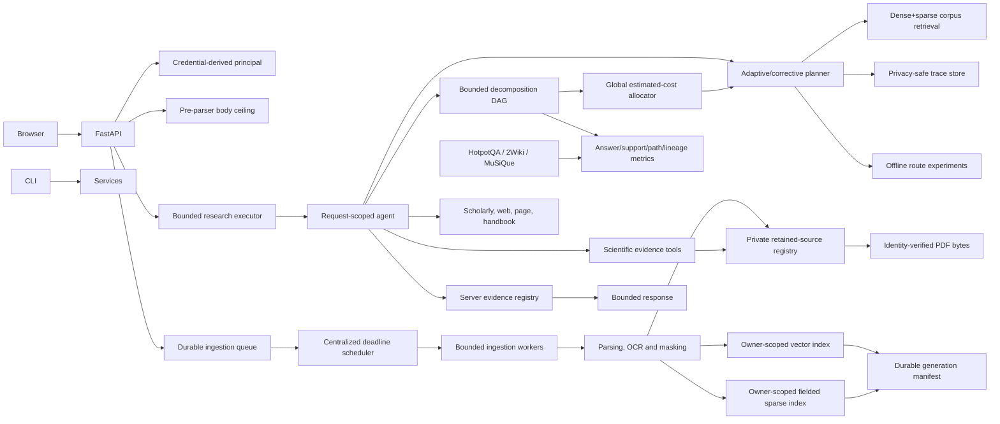

# RigorousRAG

RigorousRAG is an evidence-oriented academic search and document-research platform. It combines:

- a resumable, allowed-domain TF-IDF/PageRank search engine;
- owner-scoped dense and fielded-sparse retrieval over PDF, DOCX, Markdown and text files;
- authoritative vector+sparse+generation manifests and reconciliation tooling;
- hybrid, adaptive, corrective and bounded multi-hop retrieval;
- privacy-safe adaptive trace persistence and offline route experiments;
- confidence calibration, risk-coverage and abstention analysis;
- strict local HotpotQA, 2WikiMultiHopQA and MuSiQue evaluation adapters;
- an OpenAI-compatible request-scoped research agent;
- bounded scholarly, web, page, handbook and scientific-analysis tools;
- crash-recoverable ingestion, optional bounded OCR and retained-source management;
- a self-contained browser interface and hardened single-host container deployment.

The project is a research platform, not a proof engine. Citation presence, retrieval rank, generation alignment and cross-hop grouping do not prove semantic support or scientific correctness. Inspect cited sources and apply domain review.

## Repository policy and status

- `main` is the authoritative and only live branch.
- Historical pull requests are closed; surviving work is preserved in `main` history.
- New work is committed directly to `main` without feature branches or pull requests.
- Source, tests, documentation, configurations and status ledgers are updated together.
- Release readiness requires the complete workflow on one unchanged exact `main` SHA.

See [Current Remediation Status](docs/REMEDIATION_STATUS.md), [Capability Status](docs/CAPABILITY_IMPLEMENTATION_STATUS.md), [Exhaustive TODO](docs/TODO.md) and the [Mission Audit](docs/EXHAUSTIVE_MISSION_AUDIT_2026-08-01.md).

## Architecture



Detailed architecture and trust boundaries are in [Goals and Architecture](docs/GOALS_AND_ARCHITECTURE.md). Multi-hop design is documented in [Bounded Multi-hop Retrieval](docs/MULTIHOP_RETRIEVAL.md).

## Implemented capability foundations

### Secure ingestion and lifecycle

- credential-derived tenant identity;
- pre-parser request-body and streamed upload ceilings;
- random owner-scoped files with no-follow/symlink/reparse defenses;
- durable queued/processing/finalizing/success/failed jobs;
- atomic claims, retry ceilings, persisted backoff and startup replay contracts;
- bounded PDF/DOCX/text parsing and optional OCR;
- best-effort privacy masking over text and metadata;
- private retained-source registry and on-demand byte-identity verification;
- owner-scoped list, retrieval, replacement and deletion.

### Authoritative retrieval

- dense vector retrieval with parent/child provenance;
- persistent fielded BM25 with page, section, frequency and position traces;
- embedding profiles for MiniLM, E5, BGE, GTE, Instructor, SPECTER2 and BGE-M3;
- vector and sparse snapshots with compensating restoration;
- append-only generation history and current pointers;
- generation/profile/content-hash validation before evidence publication;
- dense, lexical, candidate-hybrid, corpus-sparse and corpus-hybrid modes;
- weighted/RRF fusion, MMR and optional reranking;
- BEIR-style evaluation and resumable experiment records.

### Adaptive retrieval, traces and route experiments

- query intent and complexity analysis;
- evidence sufficiency using score, diversity, provenance and generation signals;
- bounded corrective attempts with cost estimates and traces;
- conservative abstention when evidence remains insufficient;
- privacy-safe SQLite trace persistence using query hashes and bounded aggregate records;
- strict filtering of private/internal fields from public adaptive payloads;
- offline reproducible dense, sparse, hybrid, web and scholarly route fixtures;
- router/oracle success, route accuracy, utility, latency/cost proxy and regret reports;
- Brier score, ECE, reliability bins, isotonic calibration and risk-coverage analysis.

The route experiment harness verifies routing mechanics and report reproducibility. It does not establish calibrated production routing until representative connected experiments, repeated seeds and promotion thresholds are completed.

### Multi-hop retrieval and evaluation

- bounded deterministic or strict-schema model-assisted query decomposition;
- validated acyclic dependency graphs with stable fingerprints;
- parallel independent hops and serial dependent batches;
- entity/time constraints and bounded dependency-derived lexical hints;
- a hard global estimated-cost ceiling with minimum-attempt reservation and per-hop allocation;
- immutable hop/source/document/page lineage;
- evidence joins without synthetic citations or source collapse;
- answer exact match/token F1 and document/support precision-recall-F1;
- page, section, field, source, sentence and paragraph support locators;
- path completeness, hop coverage, lineage validity and abstention metrics;
- strict local HotpotQA, 2WikiMultiHopQA and MuSiQue JSON/JSONL adapters;
- dataset byte fingerprints, UTF-8/size/nesting limits, duplicate-key/NaN refusal and symlink/reparse protection.

The public multi-hop module is implemented and focused-tested; full agent/API/browser registration remains an explicit integration task. Estimated cost is a deterministic workload proxy, not measured token, latency or monetary cost. Dataset adapters validate formats but do not download data or establish license suitability.

### Scientific and public evidence tools

- exact caption-adjacent figure rendering under page/pixel/payload ceilings;
- conservative protocol extraction;
- advocate/skeptic/judge analysis with original evidence;
- cross-paper comparisons, conflict analysis and limitation extraction;
- deterministic escaped BibTeX;
- bounded scholarly, web, page and handbook retrieval;
- connected-peer SSRF protection, redirect revalidation and strict provider payloads.

### Browser, CLI and deployment

- DOM-based rendering without untrusted `innerHTML`;
- no third-party runtime JavaScript/font dependency;
- session-only API keys and history;
- bounded terminal-safe CLI output;
- non-root read-only container, dropped capabilities and loopback publishing by default;
- readiness checks for HTTP, SQLite stores and writable state volumes.

## Installation

The package declares Python `>=3.10,<3.14`. The configured full CI matrix currently targets Python 3.10–3.12.

```bash
python -m venv .venv
source .venv/bin/activate              # Windows: .venv\Scripts\activate
python -m pip install --upgrade pip
python -m pip install -r requirements.txt
```

For tests and development tools:

```bash
python -m pip install -r requirements-dev.txt
```

OCR requires the Tesseract executable in addition to Python packages. The supplied Docker image installs it. Sentence-transformer weights may be downloaded the first time an embedding profile is initialized; preload or mirror required models for isolated deployments.

## Configuration

Copy `.env.example` and set only values needed for the deployment. Important groups include:

| Group | Representative variables |
|---|---|
| Identity | `API_KEY_OWNERS_JSON`, `SINGLE_USER_OWNER_ID` |
| Models | `DEFAULT_MODEL`, `ALLOWED_MODELS`, `EMBEDDING_MODEL` |
| Query/tool admission | `QUERY_WORKERS`, `QUERY_MAX_PENDING`, `MAX_CONCURRENT_TOOL_WORKERS`, `MAX_PENDING_TOOL_TASKS` |
| Upload/ingestion | `MAX_REQUEST_BODY_BYTES`, `MAX_UPLOAD_BYTES`, `INGEST_WORKERS`, `INGEST_MAX_ATTEMPTS` |
| Parsing/OCR | `MAX_PDF_PAGES`, `MAX_EXTRACTED_CHARS`, `MAX_DOCX_MEMBERS`, `ENABLE_OCR`, `OCR_MAX_PAGES` |
| Storage | `CHROMA_PATH`, sparse/generation/registry/job database paths, optional `ADAPTIVE_TRACE_DB_PATH` |
| Network | `MAX_REMOTE_DOWNLOAD_BYTES`, `REMOTE_REQUEST_TIMEOUT_SECONDS`, `MAX_REMOTE_REDIRECTS` |
| Deployment | `RIGOROUSRAG_BIND_ADDRESS`, `RIGOROUSRAG_PORT` |

The complete inventory is in `.env.example` and the operations/security documents.

### Trusted local single-user mode

```bash
export SINGLE_USER_OWNER_ID=local-user
export OPENAI_API_KEY=...
python server.py
```

### Authenticated multi-user mode

```bash
export API_KEY_OWNERS_JSON='{"random-key-for-alice":"alice","random-key-for-lab":"lab"}'
export OPENAI_API_KEY=...
export ALLOWED_MODELS='gpt-4o,gpt-4o-mini'
python server.py
```

### OpenAI-compatible local endpoint

```bash
export OPENAI_BASE_URL=http://localhost:11434/v1
export OPENAI_API_KEY=ollama
export DEFAULT_MODEL=llama3.1
export ALLOWED_MODELS=llama3.1
python server.py
```

## Run

```bash
python server.py
```

Open `http://127.0.0.1:8000`. Core endpoints include:

- `GET /health`
- `GET /config`
- `POST /query`
- `POST /ingest`
- `GET /status/{job_id}`
- `GET /docs/list`
- `DELETE /docs/{doc_id}`
- direct scientific-tool routes documented by the server schema.

The container readiness check is stricter than `/health`: it also verifies durable stores and state-volume write/fsync/delete behavior without initializing the embedding model.

## Batch ingestion and classic search

```bash
python ingest_docs.py papers/ --recursive --owner-id local-user
python ingest_docs.py papers/ --recursive --owner-id local-user --retain-sources
python Searching.py --rebuild --max-pages 200 --max-depth 2
python Searching.py
python ai_search.py --query "continual reinforcement learning benchmarks"
```

Batch ingestion uses the shared privacy-finalized document service and authoritative multi-store commit boundary. The classic state uses generation manifests and an identity-bound storage root.

## Docker Compose

```bash
docker compose up --build
```

Compose publishes `127.0.0.1:8000` by default. Before any non-loopback deployment, configure authenticated mode, HTTPS ingress, explicit proxy trust, firewall/egress policy and secret management.

## Verification

Clean-clone release checks are intended to include:

```bash
python -m pip check
python -m compileall -q .
python -m ruff check .
python -m pytest

docker compose config --quiet
docker build --tag rigorousrag:local .
```

The exact-head workflow additionally covers Python/platform release locks and Windows storage regressions.

### Current verification state

Release readiness is **not claimed**. Focused decomposition, model-boundary, budgeting, multi-hop execution, evaluation and dataset-adapter verification passed **35 local tests**, and Python compilation passed for those seven modules and tests. Ruff was unavailable locally. No complete green workflow is observable through the available connector for the latest exact `main` SHA, and the constrained execution environment cannot resolve GitHub hosts to perform a clean clone. See [Current Remediation Status](docs/REMEDIATION_STATUS.md).

## Known limitations

- PII masking is best effort, not certified anonymization.
- File/archive checks are not malware scanning or parser sandboxing.
- Retained files rely on deployment storage for encryption at rest.
- OCR, reading order, tables, formulas, scanned captions and multi-panel figures remain heuristic.
- Python threads cannot forcibly terminate provider code that ignores deadlines.
- Application SSRF controls should be paired with network egress policy.
- Process-local schedulers, executors, rate limits, SQLite stores and compensation are not distributed exactly-once infrastructure.
- Fusion, routing, calibration and abstention thresholds require representative benchmark promotion gates.
- A valid multi-hop plan or structural quality score does not prove optimal decomposition.
- Estimated cost is not measured latency, token or monetary cost.
- Retrieval and citation lineage do not prove answer entailment.
- The heuristic answer-support metric does not prove entailment.
- Dataset-format validation does not establish dataset quality, representativeness or licensing.

## Roadmap

The canonical dependency-ordered backlog is [docs/TODO.md](docs/TODO.md). Major remaining waves include four-store repair/adoption, shadow profile migrations, benchmark calibration, heterogeneous multi-hop routing, evidence graphs, multimodal scientific parsing, structured evidence intelligence, model/dataset governance, observability and distributed production architecture.
