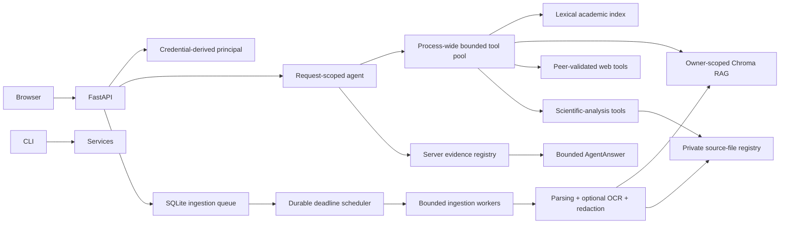

# RigorousRAG

RigorousRAG is an evidence-oriented academic search and document-research platform. It combines:

- a resumable, allowed-domain TF-IDF/PageRank search engine;
- owner-scoped semantic retrieval over PDF, DOCX, Markdown, and text files;
- an OpenAI-compatible request-scoped research agent;
- bounded public web/page tools;
- evidence-aware figure, protocol, debate, comparison, conflict, limitation, and BibTeX tools;
- crash-recoverable ingestion, optional bounded OCR, and private retained-source management;
- a self-contained browser interface and hardened container deployment.

The project is a research platform, not a proof engine. Server code selects citations from actual tool evidence, but structural provenance does not prove semantic support or scientific correctness. Inspect the cited source and apply domain review.

## Current architecture



See [Goals and Architecture](docs/GOALS_AND_ARCHITECTURE.md), [Security Model](docs/SECURITY.md), and [Remediation Status](docs/REMEDIATION_STATUS.md).

## Security and reliability properties

- Tenant identity is derived from configured API keys. `X-Owner-ID` is ignored.
- Every vector read, list, delete, comparison, limitation lookup, and figure operation is owner-scoped.
- Uploads are streamed under a byte ceiling, fsynced, type-checked, and stored under random owner directories.
- Symlinked inputs and retained sources are rejected.
- Filesystem paths are held in a private SQLite registry, never in Chroma metadata, citations, manifests, or public job responses.
- Missing retained files dynamically downgrade a document to text-only capability.
- Document deletion removes vectors, registry state, and the retained source; partial cleanup remains retryable.
- Old unreferenced uploads are reconciled after a grace period while active, retained, recent, and symlink paths are protected.
- Public-page tools reject private, loopback, link-local, multicast, reserved, and metadata-network destinations.
- Every redirect is revalidated, the actual connected peer IP is checked, environment proxies are disabled, and credentials or POST bodies cannot leak across hostile cross-origin redirects.
- Remote responses have byte and end-to-end time ceilings.
- DOCX archive expansion, PDF page count, OCR pixels, extracted characters, vector chunks, tool arguments, tool results, evidence sources, and final answers are bounded.
- Vector replacement uses compensating rollback if a batched write fails.
- Retrieved/OCR text is treated as untrusted evidence, not model instructions.
- The model cannot define authoritative citation objects.
- Tool arguments are validated at runtime against the declared schemas.
- Tool execution uses one process-wide bounded executor; timed-out calls cannot create unbounded per-request pools.
- Browser output is rendered through DOM text nodes and a constrained local Markdown renderer; no external JavaScript CDN is used.
- Raw queries and raw owner IDs are not written to telemetry. Telemetry is size-bounded and rotated.

These controls do not replace a network egress firewall, malware scanner, parser sandbox, encryption-at-rest policy, secret manager, or regulated-data review.

## Installation

Python 3.10–3.12 is targeted by CI.

```bash
python -m venv .venv
source .venv/bin/activate              # Windows: .venv\Scripts\activate
python -m pip install --upgrade pip
pip install -r requirements.txt
```

For tests and development tools:

```bash
pip install -r requirements-dev.txt
```

OCR requires the Tesseract executable in addition to the Python packages. The supplied Docker image installs it. On local systems, install Tesseract through the operating-system package manager and set `ENABLE_OCR=true` only when OCR is required.

Sentence-transformer weights may be downloaded the first time the vector store is initialized. Preload or mirror the configured embedding model for isolated environments.

## Configuration

Copy `.env.example` and set only the values needed for the deployment. The example file is the authoritative list of tunable budgets.

### Single-user local mode

With no API-key mapping configured, all requests use the server-controlled `SINGLE_USER_OWNER_ID`. Do not expose this mode to untrusted users.

```bash
export SINGLE_USER_OWNER_ID=local-user
export OPENAI_API_KEY=...
python server.py
```

### Authenticated multi-user mode

```bash
export API_KEY_OWNERS_JSON='{"random-key-for-alice":"alice","random-key-for-lab":"lab"}'
export OPENAI_API_KEY=...
export ALLOWED_MODELS='gpt-4o,gpt-4o-mini'
python server.py
```

The browser accepts an API key in the top bar and stores it only in `sessionStorage`.

### Ollama/OpenAI-compatible local endpoint

```bash
export OPENAI_BASE_URL=http://localhost:11434/v1
export OPENAI_API_KEY=ollama
export DEFAULT_MODEL=llama3.1
export ALLOWED_MODELS=llama3.1
python server.py
```

The CLI also supports:

```bash
python search_agent_cli.py --local
python search_agent_cli.py --demo
```

## Important control groups

| Group | Important variables |
|---|---|
| Identity | `API_KEY_OWNERS_JSON`, `SINGLE_USER_OWNER_ID` |
| Models and agent | `DEFAULT_MODEL`, `ALLOWED_MODELS`, `MAX_RESPONSE_TOKENS`, `MAX_CONCURRENT_TOOL_WORKERS` |
| Tool/evidence bounds | `MAX_TOOL_ARGUMENT_CHARS`, `MAX_TOOL_RESULT_CHARS`, `MAX_EVIDENCE_SOURCES` |
| Upload/source lifecycle | `MAX_UPLOAD_BYTES`, `RETAIN_SOURCE_FILES`, `ORPHAN_CLEANUP_ON_STARTUP`, `ORPHAN_GRACE_SECONDS` |
| Durable ingestion | `INGEST_WORKERS`, `INGEST_MAX_ATTEMPTS`, `INGEST_RETRY_BASE_SECONDS`, `INGEST_RETRY_MAX_SECONDS`, `JOB_TTL_SECONDS` |
| PDF/DOCX complexity | `MAX_PDF_PAGES`, `MAX_PDF_RENDER_PIXELS`, `MAX_EXTRACTED_CHARS`, `MAX_DOCX_MEMBERS`, `MAX_DOCX_UNCOMPRESSED_BYTES`, `MAX_DOCX_COMPRESSION_RATIO` |
| OCR | `ENABLE_OCR`, `OCR_MAX_PAGES`, `OCR_DPI`, `OCR_TIMEOUT_SECONDS`, `OCR_MIN_TEXT_CHARS` |
| Vector storage | `CHROMA_PATH`, `EMBEDDING_MODEL`, `MAX_CHUNKS_PER_DOCUMENT`, `MAX_DOCUMENT_LIST_SCAN_CHUNKS` |
| Remote network | `MAX_REMOTE_DOWNLOAD_BYTES`, `REMOTE_REQUEST_TIMEOUT_SECONDS`, `MAX_REMOTE_REDIRECTS`, `SERPER_MAX_RESPONSE_BYTES` |
| Telemetry | `USAGE_LOG_FILE`, `USAGE_LOG_MAX_BYTES`, `USAGE_LOG_BACKUPS` |

Set `RETAIN_SOURCE_FILES=false` when source retention is prohibited. Text retrieval continues to work, but figure/visual entailment returns an explicit insufficient-evidence result.

## Durable ingestion behavior

`POST /ingest` performs this lifecycle:

1. stream and fsync an owner-scoped random upload;
2. persist a `queued` SQLite job;
3. schedule the job without occupying a worker before its due time;
4. atomically claim it as `processing`;
5. parse, redact, and index vectors;
6. persist `finalizing` before committing the private source registry;
7. publish `success`, or persist a bounded exponential retry/failure transition.

SQLite stores retry deadlines. Startup reconciliation reschedules interrupted work, promotes already-registered finalizing documents without re-indexing, and fails exhausted or invalid-source jobs explicitly. Duplicate workers cannot both claim the same job.

This is single-host crash recovery. Distributed/high-scale deployments should replace the in-process scheduler/executor and SQLite queue with dedicated shared infrastructure.

## Parsing and OCR behavior

- Stable document identity is derived from owner ID plus source-file SHA-256, preventing two documents that redact to identical text from overwriting each other.
- Only the redacted-text hash is exposed in document metadata; the source hash remains an internal identity input.
- DOCX packages are checked for unsafe paths, duplicate/encrypted/symlink members, member count, total uncompressed size, and compression ratio before parsing.
- PDF page count, total extracted text, OCR attempts, OCR render pixels, DPI, and per-page timeout are bounded.
- OCR operates only on low-native-text pages and records attempted, successful, empty, failed, and limit-skipped page provenance.
- One failed OCR page does not discard usable native/OCR pages from the rest of the document.

## Run the web service

```bash
python server.py
```

Open `http://localhost:8000`. Useful endpoints:

- `GET /health` — process liveness;
- `GET /config` — public deployment capabilities and budgets;
- `POST /query`;
- `POST /ingest`;
- `GET /status/{job_id}`;
- `GET /docs/list`;
- `DELETE /docs/{doc_id}`;
- `POST /tool/visual-entailment`;
- `POST /tool/protocol`;
- `POST /tool/bibtex`.

The container healthcheck is stricter than `/health`: it also verifies both SQLite stores and create/fsync/delete access to the upload and vector volumes without initializing the embedding model.

## Batch ingestion

Text-only evidence:

```bash
python ingest_docs.py papers/ --recursive --owner-id local-user
```

Retain bounded private source copies for figure tools:

```bash
python ingest_docs.py papers/ --recursive --owner-id local-user --retain-sources
```

The manifest excludes internal paths. Add `--include-redacted-text` only when the redacted full text and sections are intentionally required in the export.

## Classic academic index

Build or extend the crawler/index:

```bash
python Searching.py --rebuild --max-pages 200 --max-depth 2
```

Search the persisted index without recrawling:

```bash
python Searching.py
```

AI-assisted summarization over the persisted index:

```bash
python ai_search.py --query "continual reinforcement learning benchmarks"
```

## Docker Compose

```bash
docker compose up --build
```

The container runs as a non-root user with a read-only root filesystem, dropped capabilities, bounded temporary storage, dependency-aware readiness checks, and named volumes for uploads, vectors, registry/job/crawl/telemetry data, and model cache.

## Testing

```bash
python -m compileall -q .
pytest
ruff check . --select E9,F63,F7,F82
```

CI is configured to run these checks across Python 3.10, 3.11, and 3.12 and build the container. Coverage is a regression signal, not a correctness certificate.

**Current PR verification warning:** the remediation environment could not clone/download the branch or execute Docker/pytest, and GitHub Actions has not produced an exact-head run through the available connector. The remediation PR must remain draft until checks execute and failures are corrected.

## Known limitations

- PII masking is best effort, not certified anonymization.
- File signature/archive checks are not malware scanning or parser sandboxing.
- OCR quality depends on scan quality, language packs, orientation, layout, and Tesseract.
- PDF table, equation, heading, reading-order, and multi-panel figure extraction remains heuristic.
- Figure localization requires a selectable exact caption label; scanned-caption coordinate OCR is not implemented.
- Retained sources are plaintext unless deployment storage provides encryption at rest.
- DNS resolution is a platform call that cannot be forcibly cancelled in a Python thread; application controls should be paired with network egress policy.
- The crawler indexes static HTML, not JavaScript-rendered pages or publisher PDFs.
- Scientific-analysis outputs remain model analyses and require expert/source review.
- The rate limiter and durable ingestion components are process-local/single-host.
- Python tool threads cannot be forcibly killed; bounded shared concurrency and network/provider deadlines limit impact.
- Dependency bounds are provided; release deployments should generate and verify platform-specific lock files with hashes.

## License

MIT. See [LICENSE](LICENSE).
