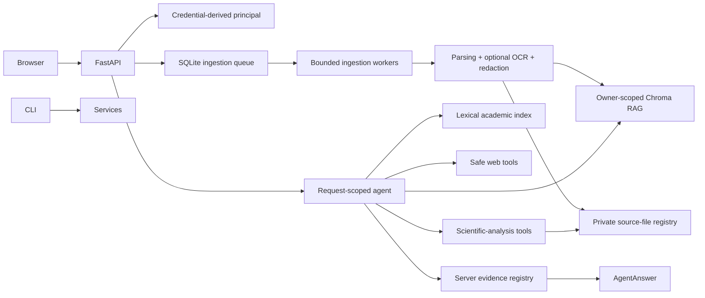

# RigorousRAG

RigorousRAG is an evidence-oriented academic search and document-research platform. It combines:

- a resumable, allowed-domain TF-IDF/PageRank search engine;
- owner-scoped semantic retrieval over uploaded PDF, DOCX, Markdown, and text files;
- an OpenAI-compatible request-scoped research agent;
- bounded public web/page tools;
- evidence-aware figure, protocol, debate, comparison, conflict, limitation, and BibTeX tools;
- durable ingestion recovery and optional bounded OCR;
- a self-contained browser interface and hardened container deployment.

The project is a research platform, not a proof engine. Citations are selected from actual tool evidence by server code, but users must still inspect the underlying source for semantic support and scientific quality.

## Current architecture



See [Goals and Architecture](docs/GOALS_AND_ARCHITECTURE.md), [Security Model](docs/SECURITY.md), and [Remediation Status](docs/REMEDIATION_STATUS.md).

## Security properties

- Tenant identity is derived from configured API keys. `X-Owner-ID` is ignored.
- Every vector read, list, delete, comparison, limitation lookup, and figure operation is owner-scoped.
- Uploads are size-bounded, type-checked, and stored under random owner directories.
- Filesystem paths are held in a private SQLite registry, never in vector metadata or API citations.
- Retained source files are deleted with their document and replaced safely on re-ingestion.
- Public-page tools reject private, loopback, link-local, reserved, and metadata-network destinations and revalidate redirects.
- Retrieved text is treated as untrusted evidence, not model instructions.
- The model cannot define authoritative citation objects.
- Browser content is rendered through DOM text nodes and a constrained local Markdown renderer; no external JavaScript CDN is used.
- Raw queries are not written to telemetry logs.

These controls do not replace a network egress firewall, malware scanner, encryption-at-rest policy, secret manager, or regulated-data review.

## Installation

Python 3.10–3.12 is supported by CI.

```bash
python -m venv .venv
source .venv/bin/activate              # Windows: .venv\Scripts\activate
python -m pip install --upgrade pip
pip install -r requirements.txt
```

For tests and development tools:

```bash
pip install -r requirements-dev.txt
```

OCR requires the Tesseract executable in addition to the Python packages. The supplied Docker image installs it. On local systems, install Tesseract through the operating-system package manager and set `ENABLE_OCR=true` only when OCR is required.

Sentence-transformer weights may be downloaded the first time the vector store is initialized. Preload or mirror the configured embedding model for isolated environments.

## Configuration

Copy `.env.example` and set only the values needed for your mode.

### Single-user local mode

With no API-key mapping configured, all requests use the server-controlled `SINGLE_USER_OWNER_ID`. Do not expose this mode to untrusted users.

```bash
export SINGLE_USER_OWNER_ID=local-user
export OPENAI_API_KEY=...
python server.py
```

### Authenticated multi-user mode

```bash
export API_KEY_OWNERS_JSON='{"random-key-for-alice":"alice","random-key-for-lab":"lab"}'
export OPENAI_API_KEY=...
export ALLOWED_MODELS='gpt-4o,gpt-4o-mini'
python server.py
```

The browser accepts an API key in the top bar and stores it only in `sessionStorage`.

### Ollama/OpenAI-compatible local endpoint

```bash
export OPENAI_BASE_URL=http://localhost:11434/v1
export OPENAI_API_KEY=ollama
export DEFAULT_MODEL=llama3.1
export ALLOWED_MODELS=llama3.1
python server.py
```

The CLI also supports:

```bash
python search_agent_cli.py --local
python search_agent_cli.py --demo
```

## Important environment variables

| Variable | Purpose | Default |
|---|---|---|
| `OPENAI_API_KEY` | Cloud/model-provider credential | unset |
| `OPENAI_BASE_URL` | OpenAI-compatible endpoint | provider default |
| `DEFAULT_MODEL` | Server default model | `gpt-4o` |
| `ALLOWED_MODELS` | Comma-separated model allowlist | default model only |
| `API_KEY_OWNERS_JSON` | JSON mapping of API keys to owner IDs | unset |
| `SINGLE_USER_OWNER_ID` | Owner used only when authentication is disabled | `default_user` |
| `SERPER_API_KEY` | Optional live web-search provider key | unset |
| `MAX_UPLOAD_BYTES` | Maximum upload size | `50000000` |
| `MAX_REMOTE_DOWNLOAD_BYTES` | Maximum direct-page response | `5000000` |
| `REQUESTS_PER_MINUTE` | Per-principal modifying/analysis request limit | `60` |
| `RETAIN_SOURCE_FILES` | Retain sources for later figure/visual tools | `true` |
| `CHROMA_PATH` | Vector database directory | `rag_storage` |
| `JOB_DB_PATH` | Persistent ingestion queue/status database | `data/jobs.sqlite3` |
| `DOCUMENT_DB_PATH` | Private source-file registry | `data/documents.sqlite3` |
| `INGEST_WORKERS` | Bounded in-process ingestion workers | `2` |
| `INGEST_MAX_ATTEMPTS` | Maximum crash/retry claims per job | `3` |
| `ENABLE_OCR` | OCR low-text PDF pages | `false` |
| `OCR_MAX_PAGES` | Maximum pages eligible for OCR | `50` |
| `OCR_DPI` | OCR rendering resolution | `200` |
| `OCR_TIMEOUT_SECONDS` | Per-page OCR timeout | `30` |
| `OCR_MIN_TEXT_CHARS` | Native-text threshold before OCR | `40` |
| `EMBEDDING_MODEL` | Sentence-transformer model | `all-MiniLM-L6-v2` |

Set `RETAIN_SOURCE_FILES=false` when source retention is prohibited. Text retrieval continues to work, but figure/visual entailment will return an explicit insufficient-evidence result.

## Durable ingestion behavior

`POST /ingest` stores the upload, records a `queued` job in SQLite, and submits it to a bounded executor. A worker atomically claims the job before processing. If the service stops while a job is queued or processing, startup reconciliation requeues it when the source still exists and the attempt limit has not been reached. Completed/failed jobs are pruned after `JOB_TTL_SECONDS`.

This provides single-host crash recovery. Distributed/high-scale deployments should still replace the in-process executor and SQLite queue with a dedicated worker system and shared database.

## Optional OCR behavior

When `ENABLE_OCR=true`, only pages below `OCR_MIN_TEXT_CHARS` of selectable text are rendered and OCRed. OCR is bounded by page count, DPI, and per-page timeout. Native-text pages retain their extracted text and tables; mixed PDFs OCR only the low-text pages. OCR text is passed through exactly the same redaction, metadata masking, sectioning, hashing, and indexing pipeline as native text.

## Run the web service

```bash
python server.py
```

Open `http://localhost:8000`. Useful endpoints:

- `GET /health`
- `GET /config`
- `POST /query`
- `POST /ingest`
- `GET /status/{job_id}`
- `GET /docs/list`
- `DELETE /docs/{doc_id}`
- `POST /tool/visual-entailment`
- `POST /tool/protocol`
- `POST /tool/bibtex`

## Batch ingestion

```bash
python ingest_docs.py papers/ --recursive --owner-id local-user
```

The default manifest excludes full text, semantic sections, and internal file paths. Add `--include-redacted-text` only when the redacted text is intentionally required in the export.

## Classic academic index

Build or extend the crawler/index:

```bash
python Searching.py --rebuild --max-pages 200 --max-depth 2
```

Search the persisted index without recrawling:

```bash
python Searching.py
```

AI-assisted summarization over the persisted index:

```bash
python ai_search.py --query "continual reinforcement learning benchmarks"
```

## Docker Compose

```bash
docker compose up --build
```

The container runs as a non-root user with a read-only root filesystem, dropped capabilities, bounded temporary storage, health checks, and named volumes for uploads, vectors, registry/job data, crawl data, and model cache.

## Testing

```bash
python -m compileall -q .
pytest
ruff check . --select E9,F63,F7,F82
```

CI is configured to run these checks across Python 3.10, 3.11, and 3.12 and build the container. Coverage is a regression signal, not a correctness certificate. GitHub Actions must be enabled for the repository before those checks can execute.

## Known limitations

- PII masking is best effort, not guaranteed anonymization.
- OCR quality depends on scan quality, language packs, layout, and Tesseract; OCR output must be reviewed.
- PDF table, equation, heading, and reading-order extraction remains heuristic.
- Figure localization requires a selectable exact caption label; scanned captions may require a future OCR-coordinate pipeline.
- Retained sources are plaintext unless deployment storage provides encryption at rest.
- The crawler indexes static HTML, not JavaScript-rendered pages or publisher PDFs.
- Scientific-analysis outputs remain model analyses and require expert/source review.
- The built-in rate limiter is process-local; distributed deployments need a shared gateway or limiter.
- The durable executor is single-host. Distributed/high-scale deployments need a dedicated queue/worker system.
- Dependency bounds are provided; release deployments should additionally generate and verify a platform-specific lock file with hashes.

## License

MIT. See [LICENSE](LICENSE).
