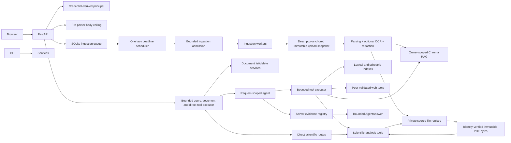

# RigorousRAG

RigorousRAG is an evidence-oriented academic search and document-research platform. It combines:

- a resumable, allowed-domain TF-IDF/PageRank search engine;
- owner-scoped semantic retrieval over PDF, DOCX, Markdown, and text files;
- an OpenAI-compatible request-scoped research agent;
- bounded public web/page and scholarly-index tools;
- evidence-aware figure, protocol, debate, comparison, conflict, limitation, and BibTeX tools;
- crash-recoverable ingestion, optional bounded OCR, and private retained-source management;
- a self-contained browser interface and hardened single-host container deployment.

The project is a research platform, not a proof engine. Server code selects citations from actual tool evidence, but structural provenance does not prove semantic support or scientific correctness. Inspect cited sources and apply domain review.

## Current architecture



See [Goals and Architecture](docs/GOALS_AND_ARCHITECTURE.md), [Security Model](docs/SECURITY.md), [Remediation Status](docs/REMEDIATION_STATUS.md), and the continuation-audit records in `docs/`.

## Security and reliability properties

- Tenant identity is derived from configured API keys. `X-Owner-ID` is ignored.
- Every vector read, list, delete, comparison, limitation lookup, and figure operation is owner-scoped.
- Total HTTP request bodies are bounded before JSON or multipart parsing, including chunked bodies.
- Uploads are streamed under an inner file-byte ceiling, fsynced, type-checked, and stored under random owner directories.
- On POSIX, upload creation/read/delete uses no-follow root and owner-directory descriptors plus descriptor-relative final-file operations; Windows uses conservative symlink and directory-identity checks.
- Queue workers parse private `0600` snapshots containing exact bytes read through the anchored owner-file boundary; they do not trust a later pathname reopen.
- Filesystem paths remain in private SQLite state and are excluded from Chroma metadata, citations, manifests, and public job responses.
- Missing or mutated retained files dynamically disable visual capability without making the source unmanaged or undeletable.
- PDF complexity preflight and figure rendering consume the same immutable byte snapshot.
- Public-page tools reject private, loopback, link-local, multicast, reserved, and metadata-network destinations.
- Every redirect is revalidated, the connected peer IP is checked, environment proxies are disabled, and credentials or POST bodies cannot leak across hostile cross-origin redirects.
- Parser, OCR, vector, request, executor, tool, evidence, telemetry, and response sizes are bounded.
- Timed-out running query/tool threads retain admission until they actually finish.
- Ingestion uses durable retry deadlines, atomic claims, one centralized scheduler, bounded executor admission, and startup reconciliation.
- Vector replacement uses compensating rollback if a batched write fails.
- Retrieved, OCR, webpage, and provider text is treated as untrusted evidence rather than instructions.
- The model cannot define authoritative citation objects.
- Browser output is rendered through DOM nodes and a constrained local Markdown renderer; no external JavaScript CDN is used.
- Raw queries and owner IDs are not written to telemetry. Telemetry is bounded, pseudonymous, process-serialized, and rotated.
- Classic crawl/index/PageRank generations use a manifest-last commit, cross-process lock, strict JSON, and an identity-bound storage root. POSIX member reads/writes are descriptor-relative; Windows uses pre/post identity validation.
- Docker Compose publishes on loopback by default, runs the container non-root with a read-only root filesystem, drops capabilities, enables `no-new-privileges`, bounds `/tmp`, and applies a PID ceiling.

These controls do not replace a network egress firewall, malware scanner, parser sandbox, encryption-at-rest policy, secret manager, TLS reverse proxy, or regulated-data review.

## Installation

Python 3.10–3.12 is targeted by CI.

```bash
python -m venv .venv
source .venv/bin/activate              # Windows: .venv\Scripts\activate
python -m pip install --upgrade pip
python -m pip install -r requirements.txt
```

For tests and development tools:

```bash
python -m pip install -r requirements-dev.txt
```

OCR requires the Tesseract executable in addition to Python packages. The supplied Docker image installs it. On local systems, install Tesseract through the operating-system package manager and set `ENABLE_OCR=true` only when OCR is required.

Sentence-transformer weights may be downloaded the first time the vector store is initialized. Preload or mirror the configured embedding model for isolated environments.

## Configuration

Copy `.env.example` and set only values needed for the deployment. The example file is the authoritative inventory of tunable budgets. Runtime requirements use bounded version ranges; release deployments should generate and verify platform-specific lock files with hashes.

### Single-user local mode

With no API-key mapping configured, all requests use the server-controlled `SINGLE_USER_OWNER_ID`. This mode is only for a trusted local workstation or an otherwise isolated network namespace.

```bash
export SINGLE_USER_OWNER_ID=local-user
export OPENAI_API_KEY=...
python server.py
```

### Authenticated multi-user mode

```bash
export API_KEY_OWNERS_JSON='{"random-key-for-alice":"alice","random-key-for-lab":"lab"}'
export OPENAI_API_KEY=...
export ALLOWED_MODELS='gpt-4o,gpt-4o-mini'
python server.py
```

The browser accepts an API key in the top bar and stores it only in `sessionStorage`.

### Ollama/OpenAI-compatible local endpoint

```bash
export OPENAI_BASE_URL=http://localhost:11434/v1
export OPENAI_API_KEY=ollama
export DEFAULT_MODEL=llama3.1
export ALLOWED_MODELS=llama3.1
python server.py
```

The CLI also supports:

```bash
python search_agent_cli.py --local
python search_agent_cli.py --demo
```

## Important control groups

| Group | Important variables |
|---|---|
| Compose exposure | `RIGOROUSRAG_BIND_ADDRESS`, `RIGOROUSRAG_PORT` |
| Identity | `API_KEY_OWNERS_JSON`, `SINGLE_USER_OWNER_ID` |
| HTTP research execution | `QUERY_WORKERS`, `QUERY_MAX_PENDING`, `QUERY_TIMEOUT_SECONDS` |
| Models and agent | `DEFAULT_MODEL`, `ALLOWED_MODELS`, `RETRIEVAL_EXPANSION_MODEL`, `MAX_RESPONSE_TOKENS`, `LEGACY_LLM_TIMEOUT_SECONDS` |
| Tool admission/evidence | `MAX_CONCURRENT_TOOL_WORKERS`, `MAX_PENDING_TOOL_TASKS`, `MAX_TOOL_ARGUMENT_CHARS`, `MAX_TOOL_RESULT_CHARS`, `MAX_EVIDENCE_SOURCES` |
| Request/upload lifecycle | `MAX_REQUEST_BODY_BYTES`, `MAX_UPLOAD_BYTES`, `RETAIN_SOURCE_FILES`, `ORPHAN_CLEANUP_ON_STARTUP`, `ORPHAN_GRACE_SECONDS` |
| Durable ingestion | `INGEST_WORKERS`, `INGEST_MAX_PENDING`, `INGEST_ADMISSION_RETRY_SECONDS`, `INGEST_MAX_ATTEMPTS`, `INGEST_RETRY_BASE_SECONDS`, `INGEST_RETRY_MAX_SECONDS`, `JOB_TTL_SECONDS` |
| PDF/DOCX complexity | `MAX_PDF_PAGES`, `MAX_PDF_RENDER_PIXELS`, `MAX_EXTRACTED_CHARS`, `MAX_DOCX_MEMBERS`, `MAX_DOCX_UNCOMPRESSED_BYTES`, `MAX_DOCX_COMPRESSION_RATIO` |
| Retained visual PDFs | `VISUAL_MAX_PDF_PAGES`, `VISUAL_MAX_RENDER_PIXELS`, `VISUAL_MAX_ENCODED_BYTES` |
| OCR | `ENABLE_OCR`, `OCR_MAX_PAGES`, `OCR_DPI`, `OCR_TIMEOUT_SECONDS`, `OCR_MIN_TEXT_CHARS` |
| Vector storage | `CHROMA_PATH`, `EMBEDDING_MODEL`, `MAX_CHUNKS_PER_DOCUMENT`, `DOCUMENT_LIST_SCAN_BATCH`, `MAX_DOCUMENT_LIST_SCAN_CHUNKS` |
| Classic state | `CLASSIC_STORAGE_DIR`, `CLASSIC_MAX_SNAPSHOT_FILE_BYTES` |
| Internal handbook | `HANDBOOK_MAX_BYTES`, `HANDBOOK_MAX_CHUNKS` |
| Remote network | `MAX_REMOTE_DOWNLOAD_BYTES`, `REMOTE_REQUEST_TIMEOUT_SECONDS`, `MAX_REMOTE_REDIRECTS`, `SERPER_MAX_RESPONSE_BYTES`, `WEB_SEARCH_MAX_RESULT_CANDIDATES` |
| Telemetry | `USAGE_LOG_FILE`, `USAGE_LOG_MAX_BYTES`, `USAGE_LOG_BACKUPS` |

Set `RETAIN_SOURCE_FILES=false` when source retention is prohibited. Text retrieval continues, but figure/visual entailment returns an explicit insufficient-evidence result.

## Durable ingestion behavior

`POST /ingest` performs this lifecycle:

1. enforce the total request-body ceiling before multipart parsing;
2. stream and fsync an owner-scoped random upload through descriptor-anchored storage under the file-byte limit;
3. persist a `queued` SQLite job;
4. schedule the job without occupying a worker before its due time;
5. obtain a bounded executor-admission slot;
6. atomically claim it as `processing`;
7. read the owner file through the anchored no-follow boundary and materialize an immutable parser snapshot;
8. parse, optionally OCR, redact, and revalidate source identity before summary/vector writes;
9. persist `finalizing` before committing the private source registry;
10. publish `success`, or persist a bounded exponential retry/failure transition.

SQLite stores retry deadlines. One lazily started heap/condition scheduler manages all delayed jobs. When executor admission is saturated, durable jobs remain queued and retry later. Startup reconciliation reschedules interrupted work, promotes already-registered finalizing documents without re-indexing, and fails exhausted or invalid-source jobs explicitly. Duplicate workers cannot both claim the same job.

This is single-host crash recovery. Distributed or high-scale deployments should replace process-local schedulers/executors and SQLite stores with dedicated shared infrastructure.

## Parsing, OCR, and retained-source behavior

- Stable document identity is derived from owner ID plus source-file SHA-256.
- The parser-facing source identity is recomputed before summary/vector writes.
- Only a redacted-text hash is exposed in public document metadata.
- DOCX packages are checked for unsafe paths, duplicate/encrypted/symlink members, member count, total uncompressed size, and compression ratio.
- PDF page count, total extracted text, OCR attempts, OCR render pixels, DPI, and per-page timeout are bounded.
- OCR operates only on low-native-text pages and records attempted, successful, empty, failed, and limit-skipped page provenance.
- One failed OCR page does not discard usable pages from the rest of the document.
- Document listing reports retained-PDF eligibility separately from verification performed when a visual action runs.
- Before pixmap allocation, the registry and renderer preflight the fixed worst-case 565-point caption clip at 2× scale.
- Caption rendering independently enforces actual pixel count and exact base64 payload length.

## Run the web service

```bash
python server.py
```

Open `http://127.0.0.1:8000`. Useful endpoints:

- `GET /health` — process liveness;
- `GET /config` — public deployment capabilities and budgets;
- `POST /query`;
- `POST /ingest`;
- `GET /status/{job_id}`;
- `GET /docs/list`;
- `DELETE /docs/{doc_id}`;
- `POST /tool/visual-entailment`;
- `POST /tool/protocol`;
- `POST /tool/bibtex`.

The container healthcheck is stricter than `/health`: it also verifies both SQLite stores and create/fsync/delete access to upload and vector volumes without initializing the embedding model.

## Batch ingestion

Text-only evidence:

```bash
python ingest_docs.py papers/ --recursive --owner-id local-user
```

Retain bounded private source copies for figure tools:

```bash
python ingest_docs.py papers/ --recursive --owner-id local-user --retain-sources
```

The CLI refuses symlinked inputs, publishes the manifest atomically, excludes internal paths, and restores the previous vector generation if later source-registry finalization fails. Add `--include-redacted-text` only when redacted full text and sections are intentionally required in the export.

## Classic academic index

Build or extend the crawler/index:

```bash
python Searching.py --rebuild --max-pages 200 --max-depth 2
```

Search the persisted index without recrawling:

```bash
python Searching.py
```

AI-assisted summarization over the persisted index:

```bash
python ai_search.py --query "continual reinforcement learning benchmarks"
```

The classic state directory is identity-bound. Replacing it or one of its parents with a symlink after startup fails closed.

## Docker Compose

```bash
docker compose up --build
```

Compose publishes `127.0.0.1:8000` by default. Open `http://127.0.0.1:8000` from the same host.

Before publishing on all interfaces, configure authenticated multi-user mode and deliberate ingress controls:

```bash
export API_KEY_OWNERS_JSON='{"replace-with-random-key":"owner"}'
export RIGOROUSRAG_BIND_ADDRESS=0.0.0.0
docker compose up --build
```

A non-loopback deployment should also use an HTTPS reverse proxy, firewall policy, explicit trusted-proxy handling, secret management, and network egress controls. Uvicorn proxy-header trust is not enabled by the supplied container command.

The container runs as a non-root user with a read-only root filesystem, dropped capabilities, `no-new-privileges`, bounded temporary storage, a PID limit, dependency-aware readiness checks, and named volumes for uploads, vectors, registry/job/crawl/telemetry data, and model cache.

## Testing

```bash
python -m pip check
python -m compileall -q .
python -m ruff check . --select E9,F63,F7,F82
python -m pytest

docker compose config --quiet
docker build --tag rigorousrag:local .
```

CI is configured to run dependency checks, compile, fatal Ruff checks, pytest/coverage across Python 3.10, 3.11, and 3.12, validate Compose, and build the container. Coverage is a regression signal, not a correctness certificate.

**Current PR verification warning:** the remediation environment cannot clone or download the branch because `github.com` DNS resolution fails. No exact-current-head GitHub Actions result has been observed through the available connector. The remediation PR must remain draft until every configured check executes against the final head and all failures are corrected.

## Known limitations

- PII masking is best effort, not certified anonymization.
- File signature/archive checks are not malware scanning or parser sandboxing.
- OCR quality depends on scan quality, language packs, orientation, layout, and Tesseract.
- PDF table, equation, heading, reading-order, and multi-panel figure extraction remains heuristic.
- Figure localization requires a selectable exact caption label; scanned-caption coordinate OCR is not implemented.
- Retained sources are plaintext unless deployment storage provides encryption at rest.
- DNS resolution is a platform call that cannot be forcibly cancelled in a Python thread; application controls should be paired with network egress policy.
- The crawler indexes static HTML, not JavaScript-rendered pages or publisher PDFs.
- Scientific-analysis outputs remain model analyses and require expert/source review.
- Rate limiting, schedulers, executors, SQLite stores, and compensation workflows are process-local/single-host.
- Python query/tool threads cannot be forcibly killed; bounded admission and provider/network deadlines limit impact.
- Writable or privileged host access can mutate process storage or memory; filesystem anchoring is not a substitute for host isolation.
- Runtime dependency bounds are not a release lock; production builds should generate and verify platform-specific lock files with hashes.
