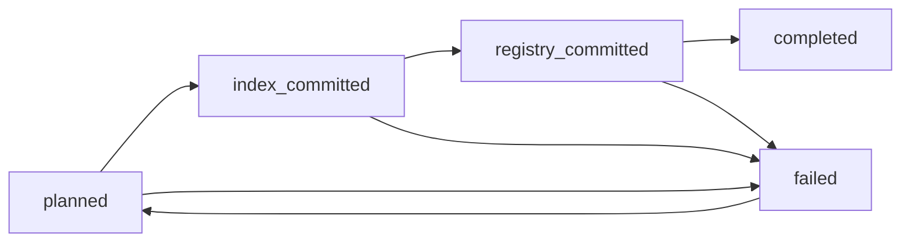

# Four-store authoritative document lifecycle

Last updated: 2026-08-01

RigorousRAG coordinates four durable document capabilities:

1. dense vector rows;
2. persistent sparse fields;
3. append-only authoritative generation manifests;
4. the retained-document registry and optional retained source file.

The first three are committed by `AuthoritativeIndexCoordinator`. The fourth is coordinated through a durable lifecycle outbox and a private source-cleanup journal.

## Storage surfaces

| Surface | Default path | Purpose |
|---|---|---|
| Vector store | `CHROMA_PATH` | Owner/document-scoped vector rows and metadata. |
| Sparse store | `SPARSE_INDEX_PATH` | Owner/document/generation-scoped fielded sparse records. |
| Generation store | `INDEX_GENERATION_DB_PATH` | Append-only active/restored/deleted generation history and current pointer. |
| Document registry | `DOCUMENT_DB_PATH` | Owner-scoped filename, MIME type and retained-source capability. |
| Lifecycle outbox | `LIFECYCLE_OUTBOX_DB_PATH` | Durable replacement/deletion intent and phase journal. |
| Cleanup journal | `LIFECYCLE_CLEANUP_DB_PATH` | Private retained-source cleanup intent persisted before registry mutation. |

The outbox and cleanup journal are separate so an existing outbox schema did not need an unsafe in-place expansion while active operations might exist.

## Replacement state machine



### `planned`

The operation records:

- deterministic operation ID;
- owner and document identity;
- exact content SHA-256;
- filename and MIME type;
- whether a retained source is required;
- private retained path when required;
- retry ceiling.

The intent is created before vector/sparse/generation mutation.

### `index_committed`

The authoritative generation must exist in `active` or `restored` state and must match:

- owner;
- document;
- exact content hash;
- recorded generation sequence when one has already been assigned.

A crash after the three-store commit but before the phase update can be recovered because the current exact matching generation is detected and adopted by the existing intent. A nonmatching or superseding generation is refused.

### `registry_committed`

Before replacing the registry row, any prior retained source path is written to the private cleanup journal. The registry is then updated idempotently. The lifecycle phase is advanced only after that succeeds.

### `completed`

Any cleanup intent must be removed successfully or the source must already be absent. Only then is the lifecycle operation completed.

## Deletion state machine

A deletion intent is created before authoritative vector/sparse/generation deletion. After the generation becomes `deleted`, the same operation removes the registry capability and retained source.

Deletion retries search for an existing pending owner/document delete operation. This prevents a crash from deriving a second operation ID after the generation sequence changes from active to deleted.

If more than one pending deletion exists for one owner/document pair, deletion fails closed for operator inspection.

## Leases and failures

Lifecycle workers claim bounded pending operations with:

- worker identity;
- expiry timestamp;
- bounded lease duration;
- attempt counter;
- maximum attempts.

Leases remain attached across intermediate phase transitions. They clear when:

- the operation completes;
- the worker releases a waiting operation;
- a failure is recorded.

Persisted failures contain only a generic exception class such as `RuntimeError`. Provider details, database paths and retained source paths are not included in public summaries or error records.

A failed operation may be reset only through an exact-confirmation operator action.

## Source-cleanup durability

A registry mutation could otherwise lose a prior source path:

1. read old registry row;
2. replace/delete registry row;
3. process crashes before removing old file.

The cleanup journal changes the order:

1. validate and persist old source path under the lifecycle operation ID;
2. mutate registry;
3. mark registry phase committed;
4. remove the file idempotently;
5. clear cleanup intent;
6. complete lifecycle operation.

If the process crashes after file removal but before clearing the journal, replay accepts the already-absent file and clears the intent.

Source removal is restricted to validated regular files under the configured upload root. Paths outside the root, redirected paths and malformed paths are refused.

## API and durable-worker ingestion

Durable jobs provide the private source path through `JobStore`. The lifecycle boundary validates that path under the document registry upload root before creating a retained-source intent.

The owner/document lock is held across:

- intent planning;
- vector/sparse/generation commit or adoption;
- registry reconciliation;
- cleanup handoff.

A registry failure after indexing can therefore be retried without a second vector or sparse write.

## Batch retained-source ingestion

Batch ingestion historically copied a source, indexed the document, and then registered the retained copy separately. A crash between indexing and registration could leave a correct generation without its retained-source capability.

The batch bridge uses a one-use `ContextVar`:

1. `DocumentStore.copy_source` records the successful owner-scoped copy.
2. `document_service.index_document` consumes the intent once.
3. The copied file is validated under the upload root.
4. Its bytes are rehashed and must produce the exact owner-scoped document UUID.
5. The document's private `file_path` is temporarily bound to the retained copy.
6. The normal authoritative lifecycle boundary commits the registry capability.
7. The original `file_path` is restored after indexing.

Owner or byte-identity mismatch fails closed and clears the one-use intent.

The batch script's historical second registration is harmless but redundant. `DocumentStore.register` now short-circuits before another SQLite write when owner/document/source/MIME capability already matches, avoiding a transient second-write failure and preventing accidental cleanup of the current retained source.

## Reconciliation before retrieval

The published `tools.rag` module is lazily wrapped so `get_rag_layer` performs one bounded lifecycle reconciliation pass before the process first serves retrieval.

- Pending operations are claimed under leases.
- Each operation is reconciled under the existing owner/document lock.
- Exact generation matching is required.
- Waiting operations are released for later replay.
- Error or failed outcomes prevent startup retrieval reconciliation from being marked complete.

This is process-local startup reconciliation, not distributed leader election.

## Operator CLI

```bash
python -m tools.lifecycle_cli pending --limit 100
python -m tools.lifecycle_cli pending --owner-id alice --limit 100
python -m tools.lifecycle_cli status lifecycle-<sha256>
python -m tools.lifecycle_cli reconcile --limit 100 --lease-seconds 60
python -m tools.lifecycle_cli retry-failed lifecycle-<sha256> \
  --confirm-operation-id lifecycle-<same-sha256>
```

CLI output contains public summaries only:

- operation ID;
- owner and document ID;
- operation kind and state;
- generation sequence;
- retention flag;
- attempts and maximum attempts;
- generic last error type;
- timestamps.

It never prints retained source paths, registry payloads, provider errors or database paths.

## Configuration

```dotenv
LIFECYCLE_OUTBOX_DB_PATH=data/lifecycle_outbox.sqlite3
LIFECYCLE_CLEANUP_DB_PATH=data/lifecycle_cleanup.sqlite3
LIFECYCLE_RECONCILE_LIMIT=100
LIFECYCLE_LEASE_SECONDS=60
```

## Focused contracts

Committed tests cover:

- deterministic owner-scoped operation IDs;
- idempotent planning and immutable-field conflicts;
- strict phase transitions;
- leases, renewal, release, retry ceilings and failed-operation reset;
- exact-generation replacement and deletion replay;
- generic failure persistence without private details;
- database and parent identity replacement;
- symlink/reparse refusal;
- cleanup intent before registry mutation;
- crash after cleanup but before journal clearing;
- deletion cleanup ordering;
- registry failure replay without reindexing;
- crash recovery before `index_committed` is recorded;
- superseding-generation refusal;
- deletion operation-ID reuse after sequence change;
- startup reconciliation before RAG construction;
- path-scoped idempotent source removal;
- privacy-safe operator CLI output and exact-confirmation retry;
- batch copy owner/byte identity;
- one-use retained-source context;
- temporary source binding and restoration;
- redundant batch registration short-circuit;
- lazy import behavior including modules that replace themselves in `sys.modules`.

Focused partial-workspace tests passed, but complete exact-head repository and cross-platform fault-injection verification remain required.

## Remaining lifecycle work

- Add exact-head clean-clone API and batch ingestion fault injection at every phase.
- Add readiness checks for lifecycle and cleanup journal availability.
- Add retention/compaction policy for completed operations.
- Add operator export and audit-event correlation without private paths.
- Add distributed leases or leader election before multi-process/multi-host deployment.
- Evaluate consolidating the cleanup journal into a future explicitly migrated outbox schema.
- Add retained-source reindex and reviewed pre-manifest adoption workflows.

## Non-claims

- The outbox provides idempotent process-local recovery, not a distributed atomic transaction.
- SQLite leases are not distributed consensus.
- A matching generation proves storage alignment, not factual correctness.
- Retained-source identity validates bytes and owner/document linkage, not malware safety.
- Startup reconciliation does not replace periodic reconciliation in a multi-process deployment.
