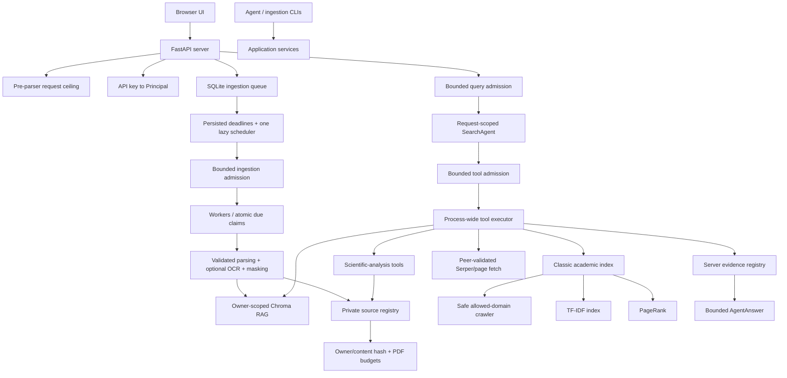

# RigorousRAG Goals and Architecture

## Product goal

RigorousRAG is an evidence-oriented academic research platform with two complementary retrieval systems:

1. A local, resumable crawler and sparse lexical index over an explicitly allowed set of public academic, governmental, educational, and reference domains.
2. An owner-scoped vector index over user-uploaded PDF, DOCX, Markdown, and text documents.

An OpenAI-compatible request-scoped agent may orchestrate those retrieval systems, public web search, direct public-page extraction, a small internal handbook, and scientific-analysis tools. Every final citation is selected from actual tool evidence by server code rather than authored by the model.

## Non-goals

The system does not claim that:

- a trusted hostname makes every page scientifically trustworthy;
- a citation marker proves semantic entailment;
- role-prompted model analyses are independent experiments or reviewers;
- best-effort regular-expression masking guarantees anonymization;
- OCR reproduces every character, table, formula, or layout correctly;
- visual, comparison, conflict, protocol, or limitation tools replace expert review;
- a preprint and a peer-reviewed article have equivalent evidentiary status;
- compensating Chroma writes are a formal cross-store transaction;
- process-local schedulers, executors, limiters, and SQLite stores are a distributed exactly-once system;
- a Python timeout forcibly terminates third-party code already running in a thread.

## Core goals

### Classic academic retrieval

- Breadth-first crawling restricted to explicit host suffixes.
- Connected-peer verification, redirect revalidation, credential-safe redirects, and bounded response streaming.
- One end-to-end remote time budget rather than an independent timeout per chunk or redirect.
- Configurable robots.txt policy with cached decisions.
- Resumable frontier, page, graph, index, and PageRank persistence.
- Generation manifests with hashes/counts so partial multi-file saves fail closed instead of mixing state.
- Unicode and scientific-identifier-aware tokenization.
- Smoothed TF-IDF with title weighting.
- Convergent PageRank over fetched pages only.
- Calibrated lexical-authority score combination.
- Offline search without mandatory recrawling.

### Uploaded-document RAG

- Mandatory owner filter on every vector read, list, replace, delete, comparison, and figure operation.
- Stable document identity derived from owner ID and source-file SHA-256; the source hash is not exported.
- A second source-identity verification immediately before indexing.
- Deterministic parent/child chunk identifiers.
- Semantic sections passed from ingestion into vector indexing.
- Parent-child retrieval with page, section, chunk, and document provenance.
- Optional HyDE and multi-query expansion with request budgets.
- Explicit document-ID filtering.
- Owner-scoped document listing and deletion.
- Pagination by chunks until the requested number of distinct documents or a scan ceiling.
- Compensating restoration of previous chunks after failed batched replacement.
- Evidence-only vector metadata: no filesystem paths or private queue state.

### Ingestion

- A total ASGI request-body ceiling before JSON/multipart parsing and an inner streamed source-file ceiling.
- File-size, extension, signature, symlink, and binary-text validation.
- PDF, DOCX, Markdown, and plain-text extraction.
- DOCX path/member/encryption/expansion/compression-ratio limits.
- PDF page, total-text, OCR-render-pixel, and OCR-attempt limits.
- Sorted native PDF text, page provenance, basic table extraction, and optional bounded OCR of low-text pages.
- Complete masking pass over native text, OCR text, titles, metadata, summaries, and every section.
- Metadata masking for local paths, URI credentials, and common secret query parameters.
- Safe serialization that excludes local storage paths and source hashes.
- Shared CLI/API parsing and indexing service.
- Beginning/middle/end sampling for optional two-sentence summaries.
- Source-byte identities that prevent different files masking to identical text from replacing one another.

### Source-file lifecycle

- Streamed and `fsync`ed random owner-scoped uploads.
- Immediate removal if the durable queue row cannot be committed.
- A private SQLite document registry keyed by owner and document ID.
- Filesystem paths held only in private queue/registry state, not Chroma or API output.
- Configurable source retention for later visual inspection.
- Dynamic validation of retained-source availability.
- Cheap document-list eligibility checks and on-demand full visual verification.
- Visual verification re-hashes current retained bytes against the owner/content document ID.
- Visual PDF page count, caption-region render geometry, and clip height are bounded.
- Unsafe or mutated retained files remain protected/deletable but are not returned to visual tools.
- Safe source replacement after successful re-ingestion.
- Document deletion removes vectors, registry state, and any retained source under `UPLOAD_DIR`.
- Grace-period orphan reconciliation that protects active, retained, recent, and symlink paths and fails closed when reference stores are unavailable.

### Durable jobs

- SQLite-backed `queued`, `processing`, `finalizing`, `success`, and `failed` states.
- Owner-scoped public status with private source paths excluded and internal exception text redacted.
- Atomic due-time claim so only one worker/process can claim a queued job.
- Persisted `next_attempt_at` and bounded exponential retry delay.
- One lazily started keyed heap/condition scheduler for all delayed jobs; no timer thread per job.
- `INGEST_MAX_PENDING` bounds running plus executor-queued ingestion work.
- Saturated durable jobs remain queued and retry admission later instead of entering an unbounded in-memory queue.
- Startup reconciliation for interrupted jobs whose source and retry budget remain valid.
- Promotion of already-registered finalizing jobs without re-indexing.
- Explicit failure for missing, exhausted, or out-of-root recovery sources.
- Failed jobs clear document IDs that never committed.
- Expiry of completed/failed status records.

### Agent and provenance

- One immutable agent context per request.
- Credential-derived owner identity.
- Server allowlist for model selection.
- `/query` uses a dedicated process-wide bounded executor with explicit running-plus-queued admission and a whole-request deadline.
- Maximum turns, tool calls, tool timeout, request timeout, model output, tool arguments/results, evidence sources, and query length.
- Runtime validation of tool arguments against declared schemas.
- One process-wide tool executor with independent running and total-pending limits instead of a pool per request.
- Timed-out running query/tool work keeps its admission slot until actual completion.
- Retrieved text treated as untrusted data rather than instructions.
- Server-side evidence registry, deduplication, and deterministic citation labels.
- Model output contributes answer prose only; model-provided citation objects are ignored.
- Retrieval-only fallback when no model provider is configured, with outages distinguished from no matches.
- Rotated query/owner-hashed telemetry with bounded event serialization.

### Scientific-analysis tools

- Figure checks based on an exact caption-adjacent rendered region.
- Owner/document source resolution through the private registry after current-byte identity and PDF-complexity verification.
- Conservative protocol extraction that does not invent absent details.
- Advocate, skeptic, and judge analyses in which the judge receives the original evidence.
- Cross-paper comparisons and matrices that stop when any required document lacks evidence.
- Conflict analysis that distinguishes direct contradiction from different conditions or populations.
- Limitation extraction from explicit text or owner-scoped retrieval.
- Deterministic, escaped BibTeX output with venue and entry-type support.

A separate exact post-PNG/base64 output-byte limit and OCR-coordinate localization for scanned captions remain future work. Direct scientific HTTP routes are rate-limited but do not yet share `/query`'s dedicated whole-route executor/deadline.

### Service and interface

- FastAPI request validation and separate liveness/container-readiness contracts.
- Pre-parser declared/streamed body enforcement that also completes already-started partial responses.
- API-key-to-owner mapping for authenticated deployments.
- Strict reflected request IDs and bounded model/job/document/response identifiers.
- Owner-scoped durable jobs and document records.
- Browser interface without external JavaScript/font dependencies.
- DOM construction through text nodes and a constrained local Markdown renderer.
- Session-only conversation history and API-key storage.
- Mobile-accessible document and scientific-tool drawers.
- Non-root, read-only container deployment with dropped capabilities.
- Readiness probe for HTTP, both SQLite stores, and writable upload/vector volumes without initializing the embedding model.

## Architecture

## Trust boundaries

- Browser input and API path/header/body values are untrusted.
- API keys identify principals; owner headers do not.
- Uploaded files and archive members are untrusted binary input.
- Retained files may be mutated by the host and are revalidated before visual use.
- OCR output is untrusted extracted text.
- Web URLs, DNS answers, connected peers, redirect targets, and provider payloads are untrusted network input.
- Retrieved text is untrusted model context.
- Model output is untrusted prose and cannot define authoritative citations or tenant scope.
- Chroma contains evidence metadata, not private source paths.
- Source paths, retry deadlines, and queued-job internals remain private server-side state.
- Executor admission is process-local; distributed deployments need shared infrastructure.

## Data lifecycle

1. The ASGI layer rejects an oversized total request before framework body parsing.
2. The service streams a supported file under a random owner-scoped storage name, enforces the inner file limit, and `fsync`s it.
3. A durable owner-scoped `queued` job records its private source path; failed queue creation removes the file.
4. The centralized scheduler releases the job when its persisted deadline is due.
5. The job obtains bounded executor admission, then one worker atomically claims it as `processing`.
6. The parser validates signatures, archive/PDF/text complexity, and extracts native/OCR text.
7. Every text and metadata representation is masked.
8. A stable owner-and-source document ID is computed without exporting the source hash.
9. The source identity is reverified immediately before summary/vector writes.
10. Redacted semantic sections are indexed with deterministic child IDs; failed replacement invokes compensating restoration.
11. The job enters `finalizing`, then the private registry records the retained source or text-only state.
12. The job becomes `success` only after vector and registry handling finish.
13. Transient failures return to `queued` with a persisted exponential deadline; exhausted failures clear unusable document IDs.
14. Retrieval always includes the authenticated owner's filter.
15. Document listing reports retained PDF eligibility without expensive scanning.
16. A visual request re-hashes retained bytes, verifies `doc_id`, and checks PDF page/render budgets before rendering the caption region.
17. Document deletion removes vector chunks, registry state, and any retained source.
18. Startup reconciliation reschedules interrupted jobs or promotes durable finalization state.
19. Orphan reconciliation deletes only old regular files unreferenced by active jobs or retained documents.

## Verification philosophy

Tests target invariants rather than private implementation methods. Required clean-clone checks are:

- Python bytecode compilation;
- fatal syntax/name lint checks;
- contract and regression tests for identity, request-body limits, query overload/deadlines, tool admission/timeouts, connected-peer SSRF, redirect secrets, total network deadlines, upload durability, archive/parser bounds, masking, OCR, source revalidation, visual PDF identity/complexity, durable claims/centralized scheduling/admission/recovery, registry isolation, vector rollback/pagination/outages, provenance, scientific fail-closed behavior, ranking, generation-committed storage, telemetry rotation, readiness, and frontend safety;
- branch coverage with an explicit baseline;
- container image build.

Coverage percentage is a diagnostic, not proof of correctness. Production claims must be based on passing checks for the exact commit being released.
