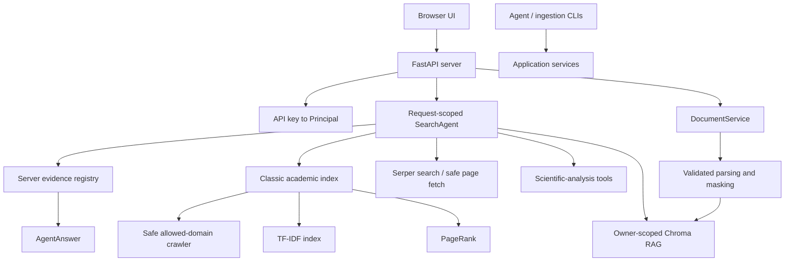

# RigorousRAG Goals and Architecture

## Product goal

RigorousRAG is an evidence-oriented academic research platform with two complementary retrieval systems:

1. A local, resumable crawler and sparse lexical index over an explicitly allowed set of public academic, governmental, educational, and reference domains.
2. An owner-scoped vector index over user-uploaded PDF, DOCX, Markdown, and text documents.

An OpenAI-compatible request-scoped agent may orchestrate those retrieval systems, public web search, direct public-page extraction, a small internal handbook, and scientific-analysis tools. Every final citation is selected from actual tool evidence by the server rather than authored by the model.

## Non-goals

The system does not claim that:

- a trusted hostname makes every page scientifically trustworthy;
- a citation marker proves semantic entailment;
- role-prompted model analyses are independent experiments or reviewers;
- best-effort regular-expression masking guarantees anonymization;
- visual, comparison, conflict, protocol, or limitation tools replace expert review;
- a preprint and a peer-reviewed article have equivalent evidentiary status.

## Core goals

### Classic academic retrieval

- Breadth-first crawling restricted to explicit host suffixes.
- Redirect revalidation and bounded response streaming.
- Configurable robots.txt policy with cached decisions.
- Resumable frontier, page, graph, index, and PageRank persistence.
- Unicode and scientific-identifier-aware tokenization.
- Smoothed TF-IDF with title weighting.
- Convergent PageRank over fetched pages only.
- Calibrated lexical-authority score combination.
- Offline search without mandatory recrawling.

### Uploaded-document RAG

- Mandatory owner filter on every vector read, list, delete, comparison, and figure operation.
- Stable document identity derived from owner and redacted content hash.
- Idempotent replacement with deterministic chunk identifiers.
- Semantic sections passed from ingestion into vector indexing.
- Parent-child retrieval with page, section, chunk, and document provenance.
- Optional HyDE and multi-query expansion with request budgets.
- Explicit document-ID filtering.
- Owner-scoped document listing and deletion.

### Ingestion

- File-size, extension, and content-signature validation.
- PDF, DOCX, Markdown, and plain-text extraction.
- Sorted PDF text, page provenance, basic table extraction, and explicit OCR-required errors for image-only documents.
- Complete masking pass over full text and every section.
- Safe serialization that excludes local storage paths.
- Shared CLI/API ingestion and indexing service.
- Beginning/middle/end sampling for optional two-sentence summaries.
- Deletion of original uploads by default; optional declared retention for later figure inspection.

### Agent and provenance

- One immutable agent context per request.
- Credential-derived owner identity.
- Server allowlist for model selection.
- Maximum turns, tool calls, tool timeout, request timeout, and bounded query length.
- Retrieved text treated as untrusted data rather than instructions.
- Server-side evidence registry and deterministic citation labels.
- Model output contributes answer prose only; model-provided citation objects are ignored.
- Retrieval-only fallback when no model provider is configured.
- Failure-isolated, query-hashed telemetry.

### Scientific-analysis tools

- Figure checks based on an exact caption-adjacent rendered region.
- Conservative protocol extraction that does not invent absent details.
- Advocate, skeptic, and judge analyses in which the judge receives the original evidence.
- Cross-paper comparisons and matrices that stop when any required document lacks evidence.
- Conflict analysis that distinguishes direct contradiction from different conditions or populations.
- Limitation extraction from explicit text or owner-scoped retrieval.
- Deterministic, escaped BibTeX output with venue and entry-type support.

### Service and interface

- FastAPI request validation and public health/config endpoints.
- API-key-to-owner mapping for authenticated deployments.
- Random owner-scoped upload storage names and bounded streaming.
- Owner-scoped jobs with expiry.
- Browser interface without external JavaScript/font dependencies.
- DOM construction through text nodes and a constrained local Markdown renderer.
- Session-only conversation history and API-key storage.
- Mobile-accessible document and scientific-tool drawers.
- Non-root, read-only container deployment with dropped capabilities.

## Architecture

## Trust boundaries

- Browser input is untrusted.
- API keys identify principals; owner headers do not.
- Uploaded files are untrusted binary input.
- Web URLs and redirect targets are untrusted network destinations.
- Retrieved text is untrusted model context.
- Model output is untrusted prose and cannot define authoritative citations or tenant scope.
- Chroma metadata and local paths are server-side data and are never accepted from a model.

## Data lifecycle

1. The service receives a bounded supported file under a random owner-scoped storage name.
2. The parser validates the content signature and extracts text/sections.
3. Every text representation is masked.
4. A stable owner-and-content document ID is computed.
5. Redacted semantic sections are indexed with deterministic child IDs.
6. The original upload is deleted unless retention is explicitly enabled.
7. Retrieval always includes the authenticated owner's filter.
8. Document deletion removes vector chunks and any retained original within the configured upload root.

## Verification philosophy

Tests target invariants rather than private implementation methods. The required clean-clone checks are:

- Python bytecode compilation;
- contract tests for identity, SSRF, upload bounds, masking, RAG ownership, provenance, scientific fail-closed behavior, ranking, storage, and frontend safety;
- coverage reporting with an explicit baseline;
- container image build.

Coverage percentage is a diagnostic, not proof of correctness. Production claims must be based on passing checks for the exact commit being released.
