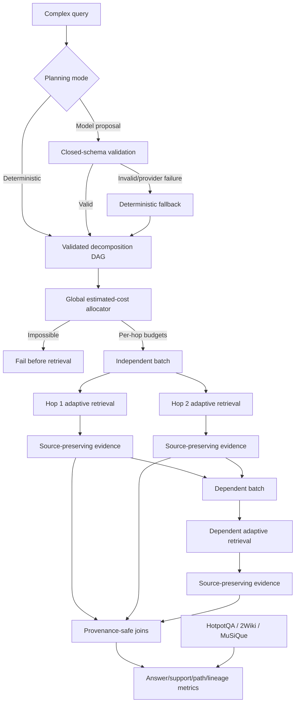

# Bounded multi-hop retrieval

RigorousRAG includes a bounded foundation for decomposing complex uploaded-document questions into an acyclic dependency graph, allocating one global retrieval budget, executing the graph without losing citation lineage and evaluating answer/support paths on common multi-hop formats.

## Components

- `tools/query_decomposition.py`
  - validates the original query and every subquestion;
  - supports explicit proposals or deterministic heuristic decomposition;
  - extracts bounded entity and temporal constraints;
  - rejects duplicate IDs, missing dependencies, cycles, controls and oversized values;
  - emits stable topological batches, terminal nodes and a SHA-256 plan fingerprint.
- `tools/decomposition_model.py`
  - accepts at most one bounded planning response from an OpenAI-compatible client;
  - uses a closed JSON schema that permits planning fields only;
  - rejects answers, citations, URLs and unsupported fields;
  - hashes the provider response without retaining model-authored evidence;
  - falls back to deterministic decomposition on provider or validation failure;
  - reports bounded token/entity/time/redundancy/parallelism/depth diagnostics.
- `tools/multihop_budget.py`
  - computes each hop's minimum viable adaptive-retrieval attempt;
  - rejects impossible per-hop or global ceilings before retrieval starts;
  - reserves all minima and distributes remaining capacity by DAG/relation complexity;
  - enforces per-hop caps, exact accounting and unused-budget reporting.
- `tools/multihop_retrieval.py`
  - runs independent nodes in parallel and dependent batches in topological order;
  - separately supplies dependency evidence to the retrieval callback;
  - bounds workers, timeouts, per-hop results, dependency evidence and total evidence;
  - preserves hop, source, document and page lineage;
  - contains individual failures/timeouts and skips missing-prerequisite paths;
  - groups cross-hop evidence without replacing original source identities.
- `tools/multihop_rag_tool.py`
  - exposes `search_uploaded_docs_multihop`;
  - uses deterministic or strict model-assisted decomposition;
  - applies one hard global estimated-cost ceiling across the DAG;
  - propagates explicit constraints and bounded dependency-derived lexical hints;
  - never promotes dependency prose into a citation;
  - serializes plan, diagnostics, budget, citations and lineage separately.
- `tools/multihop_evaluation.py`
  - scores answer exact match and Unicode token F1;
  - scores document and support precision, recall and F1;
  - recognizes page, section, field, source, sentence and paragraph locators;
  - measures complete support paths, hop coverage and citation-lineage validity;
  - records abstention and macro-aggregates repeated examples;
  - labels token-F1 multiplied by support recall as a heuristic, not entailment.
- `tools/multihop_datasets.py`
  - loads local HotpotQA, 2WikiMultiHopQA and MuSiQue JSON/JSONL;
  - preserves answer aliases and sentence/paragraph support facts;
  - records dataset SHA-256 fingerprints;
  - bounds bytes/examples/nesting and requires UTF-8;
  - rejects duplicate JSON keys, NaN/Infinity, invalid support references and duplicate IDs;
  - rejects symlink/reparse paths and non-regular files.

## Execution model

A topological batch contains nodes whose dependencies are already resolved. Nodes within a batch may run in parallel; batches run serially. A dependent node is skipped when a required prerequisite has no evidence unless the caller explicitly disables that safeguard.

## Model-planning trust boundary

The provider may propose only:

- `question_id`;
- `text`;
- `depends_on`;
- `entities`;
- `temporal_constraints`;
- `relation`.

The root may contain only `subquestions`. Every proposal is passed through the same bounded DAG validator used for deterministic plans. Unsupported fields such as answers or citations fail closed. Only a SHA-256 response digest, generic fallback reason and structural diagnostics are retained.

## Global estimated-cost budget

A per-hop ceiling alone can multiply silently with the number of subquestions. The allocator therefore:

1. computes the initial adaptive attempt and minimum estimated cost for every node;
2. refuses any per-hop limit below a node's minimum;
3. refuses a total limit below the sum of all minima;
4. reserves each minimum;
5. allocates the remainder deterministically using dependencies, relation, entities and temporal constraints;
6. stops at each per-hop cap and reports unused capacity;
7. passes only that hop's allocation into its adaptive planner.

This estimate is a deterministic workload proxy, not measured tokens, latency, energy or monetary cost.

## Citation-lineage rule

Dependency evidence may influence a later search but cannot become a synthetic citation. Every returned item retains its retrieving hop, original source identifier, document identifier, page when present, score and untouched underlying evidence object. Joins group compatible evidence without collapsing multiple sources into an invented source or implying entailment.

## Support-path evaluation

The evaluator keeps separate questions separate:

- Did the answer match an accepted alias?
- Were the required documents retrieved?
- Were the exact page/section/field/source/sentence/paragraph support facts retrieved?
- Was the complete support path present?
- Did evidence cover the required number of hops?
- Did citations preserve both hop and source identity?
- Did the system abstain?

A correct document with the wrong sentence or paragraph does not receive full support credit. The answer-support score is explicitly heuristic and does not prove semantic entailment.

## Dataset boundary

The benchmark loader is intentionally local-only. It does not download datasets, infer licenses or silently normalize malformed files. Operators must obtain each dataset under its applicable terms and record source/version/license separately. The loader fingerprints exact source bytes and returns normalized evaluation examples.

## Failure behavior

- Invalid deterministic/model-proposed plans fail before retrieval.
- Provider or model-schema failures fall back deterministically.
- Cyclic/dangling graphs fail closed.
- Impossible budgets fail before adaptive calls.
- Malformed retrieval collections become contained hop errors.
- Timed-out hops publish no late evidence.
- One failed parallel hop does not erase successful siblings.
- Dependent hops can be skipped when prerequisite evidence is missing.
- Terminal paths without evidence abstain.
- Malformed, oversized, duplicated, non-finite or path-redirected benchmark files fail closed.

Python threads cannot forcibly terminate provider code that ignores deadlines. Host-level isolation remains necessary for forcible termination.

## Verification committed

Focused contracts cover planning, model-schema validation/fallback, stable fingerprints, DAG rejection, global/per-hop budget accounting, parallel/serial execution, source-preserving joins, error/timeout behavior, dependency-term propagation, payload lineage, answer/support/path/hop/lineage metrics, strict HotpotQA/2Wiki/MuSiQue loading and malformed/path-hostile dataset refusal.

The focused local suite passed **35 tests**. Python compilation passed for the seven new modules and focused tests. Ruff was unavailable in the constrained local environment. This does not replace the complete exact-head repository matrix.

## Remaining multi-hop work

- learned decomposition ranking and benchmark-calibrated plan selection;
- dynamic entity resolution and temporal normalization;
- uploaded/web/scholarly heterogeneous hops;
- measured latency/token/monetary budgets across heterogeneous backends;
- custom governed scientific multi-document datasets;
- semantic support/entailment evaluation per hop and final synthesis;
- repeated ablations, confidence intervals and historical promotion gates;
- full agent/API/browser registration and integration tests.

## Non-claims

- A valid graph or high structural diagnostic score does not prove optimal decomposition.
- Estimated-cost allocation is not a measured resource budget.
- A cross-hop join does not prove shared claim support.
- Retrieval success does not prove answer correctness.
- Citation lineage does not prove entailment.
- The heuristic answer-support score does not prove entailment.
- Dataset-format validation does not establish dataset quality, license suitability or representativeness.
- Scientific conclusions require source inspection, expert review and replication.
