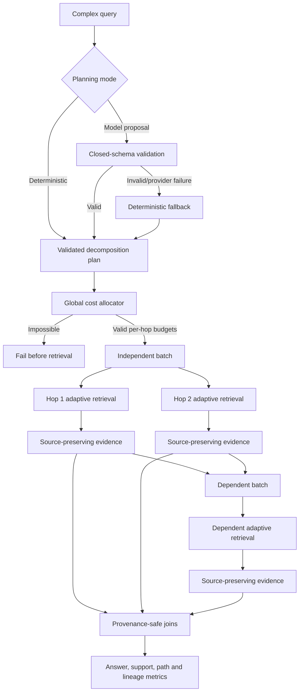

# Bounded multi-hop retrieval

RigorousRAG includes a bounded foundation for decomposing complex uploaded-document questions into an acyclic dependency graph and executing that graph without losing citation lineage.

## Components

- `tools/query_decomposition.py`
  - validates the original query and every subquestion;
  - supports explicit proposals or deterministic heuristic decomposition;
  - extracts bounded entity and temporal constraints;
  - rejects duplicate IDs, missing dependencies, cycles, controls and oversized values;
  - emits stable topological batches, terminal nodes and a SHA-256 plan fingerprint.
- `tools/decomposition_model.py`
  - accepts at most one bounded planning response from an OpenAI-compatible client;
  - uses a closed JSON schema that allows planning fields only;
  - rejects answers, citations, URLs and unsupported fields;
  - hashes the provider response without retaining model-authored evidence;
  - falls back to deterministic decomposition on provider or validation failure;
  - reports bounded token/entity/time/redundancy/parallelism/depth diagnostics;
  - does not treat its quality score as proof of optimality.
- `tools/multihop_budget.py`
  - calculates each hop's minimum viable adaptive-retrieval attempt;
  - rejects a per-hop ceiling below any minimum;
  - rejects a global ceiling below the sum of all minimums before retrieval starts;
  - reserves those minimums and weights remaining capacity by dependency and relation complexity;
  - enforces per-hop caps and exact total accounting;
  - records unused capacity when all hop caps are reached.
- `tools/multihop_retrieval.py`
  - runs independent nodes in the same batch concurrently;
  - runs dependent batches only after their prerequisites resolve;
  - separately supplies dependency evidence to the retrieval callback;
  - bounds workers, timeouts, per-hop results, dependency evidence and total evidence;
  - preserves hop, source, document and page lineage;
  - contains individual hop failures and timeouts;
  - skips dependent hops when required evidence is absent;
  - groups cross-hop evidence without replacing the original source identities.
- `tools/multihop_rag_tool.py`
  - exposes the public `search_uploaded_docs_multihop` tool contract;
  - uses deterministic or strict model-assisted decomposition;
  - allocates one hard global estimated-cost ceiling across the DAG;
  - gives each hop its recorded adaptive-retrieval budget;
  - propagates explicit entity/time constraints;
  - derives only bounded lexical search hints from dependency evidence;
  - never promotes dependency prose into a new citation;
  - serializes the plan, diagnostics, budget, citations and lineage separately.
- `tools/multihop_evaluation.py`
  - scores answer exact match and Unicode token F1;
  - scores document and support precision, recall and F1;
  - measures complete support paths, hop coverage and citation-lineage validity;
  - records abstention and macro-aggregates repeated examples;
  - labels token-F1 multiplied by support recall as a heuristic answer-support score, not entailment.

## Execution model

A topological batch is a set of nodes whose dependencies are already resolved. Nodes inside one batch may run in parallel. Batches run serially. The executor does not let a dependent node run when a required prerequisite has no evidence unless the caller explicitly disables that safeguard.

## Model-planning trust boundary

Model-assisted planning is optional and does not grant evidence authority. The provider may only propose:

- `question_id`;
- `text`;
- `depends_on`;
- `entities`;
- `temporal_constraints`;
- `relation`.

The response root may contain only `subquestions`. Every node is passed through the same bounded DAG validator used for deterministic plans. Unsupported fields such as an answer or citation fail closed. Only a SHA-256 response digest, a generic fallback reason and plan diagnostics are retained.

## Global estimated-cost budget

A per-hop ceiling alone is not a global ceiling because the effective maximum can multiply with the number of subquestions. The allocator therefore operates before retrieval:

1. Build the validated plan.
2. Compute the initial adaptive attempt and estimated minimum cost for every node.
3. Refuse a per-hop limit below any node's minimum.
4. Refuse a total limit below the sum of all minima.
5. Reserve every minimum.
6. Allocate the remainder deterministically using dependency count, relation type, entities and temporal constraints.
7. Stop at each hop's cap and report unallocated capacity.
8. Pass only that hop's allocation into its adaptive planner.

The recorded estimate is a deterministic workload proxy used by the existing adaptive retrieval policy. It is not yet a measured token, latency, energy or monetary-cost model. Cross-backend measured-cost allocation remains open.

## Citation-lineage rule

A dependency can influence a later search, but it cannot become a synthetic citation. Each returned evidence item retains:

- the hop that retrieved it;
- its original source identifier;
- its original document identifier when present;
- its original page number when present;
- its retrieval score;
- the untouched underlying citation/evidence object.

Cross-hop joins group compatible evidence by document or source. They do not collapse several sources into one invented source, do not change citation authority and do not imply entailment.

## Bounded constraint propagation

Dependent searches receive:

1. the validated subquestion;
2. extracted entity constraints;
3. extracted temporal constraints;
4. a small deterministic set of lexical terms derived from prerequisite evidence.

Raw prerequisite passages are not concatenated into the query. The propagated term list is bounded and filtered. This reduces prompt-injection and query-amplification risk while still letting later hops use facts discovered by earlier hops as retrieval hints.

## Evaluation contracts

The evaluation module separates several questions that are often incorrectly collapsed into one score:

- Did the generated answer match an accepted answer string?
- Were the required documents retrieved?
- Were the required page/section/source support facts retrieved?
- Was the complete support path present?
- Did the retrieved evidence cover the required number of hops?
- Did every citation preserve both a hop and source identity?
- Did the system abstain?

Document and support metrics are distinct. A document can be correct while the cited page or section is wrong. The answer-support score is deliberately named and documented as a heuristic product of token F1 and support recall. It is not semantic entailment.

## Failure behavior

- Invalid deterministic or model-proposed decompositions fail before retrieval.
- Provider failures and malformed model JSON fall back deterministically.
- Cyclic or dangling dependency graphs fail closed.
- Impossible global or per-hop estimated-cost budgets fail before any adaptive call.
- A malformed retrieval collection becomes a hop error.
- A timed-out hop publishes no late evidence.
- One failed parallel hop does not erase successful sibling evidence.
- Dependent hops can be skipped when required evidence is missing.
- The final result abstains when terminal hops produce no evidence.

Python threads cannot forcibly terminate provider code that ignores deadlines. The executor records the timeout and refuses late evidence, but host-level isolation is still required for forcible termination.

## Plan-quality diagnostics

The deterministic quality report measures bounded structural signals:

- original-query token coverage by leaf retrieval questions;
- explicit entity retention;
- temporal constraint retention;
- pairwise lexical redundancy;
- available parallelism;
- maximum graph depth.

The aggregate score is a diagnostic for experiments and regression tests. It is not a learned judge and is not evidence that one decomposition is semantically best.

## Verification committed

Focused contracts cover:

- comparison decomposition into two parallel lookups and one dependent comparison;
- explicit DAG batching;
- stable plan fingerprints;
- duplicate, dangling and cyclic dependency rejection;
- hostile iterable and boolean-limit rejection;
- strict model-proposal schema acceptance and rejection;
- provider-response digesting and deterministic fallback;
- bounded plan-quality diagnostics;
- minimum global/per-hop budget reservation and exact accounting;
- impossible-budget refusal before retrieval;
- weighted dependent-hop allocation and unused-capacity reporting;
- parallel evidence preservation;
- dependent-hop evidence delivery;
- source-preserving joins;
- missing-dependency skips;
- contained backend errors;
- timeout behavior without fabricated evidence;
- public adaptive multi-hop execution;
- bounded dependency-term propagation;
- citation/lineage payload separation;
- answer, document, support, path, hop, lineage and abstention metrics;
- bounded macro aggregation and hostile-input refusal.

The focused local suite passed 30 tests. Python compilation passed for the six new modules and focused tests. This is not a substitute for the complete exact-head repository matrix.

## Remaining multi-hop work

- learned decomposition ranking and benchmark-calibrated plan selection;
- dynamic entity resolution and temporal normalization;
- graph-aware measured budgets across heterogeneous corpora;
- web/scholarly/uploaded-document cross-corpus hops;
- benchmark datasets such as HotpotQA, 2WikiMultiHopQA, MuSiQue and scientific multi-document tasks;
- semantic support/entailment evaluation per hop and over the final synthesis;
- latency, monetary cost, memory, coverage and calibration regression gates;
- agent registration and browser/API presentation after full integration tests.

## Non-claims

- A valid dependency graph or high diagnostic score does not prove that the decomposition is semantically optimal.
- An estimated-cost allocation is not a measured latency, token or monetary budget.
- A cross-hop join does not prove that two passages support the same claim.
- Retrieval success does not prove answer correctness.
- Citation lineage does not prove semantic entailment.
- The heuristic answer-support score does not prove entailment.
- Final scientific conclusions still require source inspection, expert review and replication.
